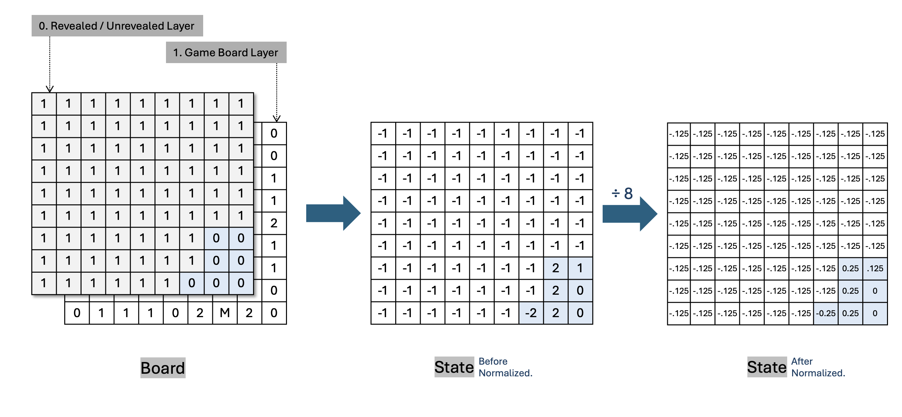

<!-- 한국어 콘텐츠 -->

  
## 01. Environment

### State 
#### Single Channel 
9*9(easy의 맵 규격)의 arr에 주변부 지뢰의 개수를 센 타일의 수(0-8)를 그대로 반영하고, 아직 까지지 않은 타일을 -1, 지뢰를 -2로 표현했다. 최댓값인 8로 전체 state arr를 나누어 state를 정규화했다. 정규화를 하지 않았을 때엔 학습이 거의 되지 않았지만, 정규화 이후에 승률이 극적으로 상승했다. 

#### Multi Channel 
`env.dim2` 클래스 파라미터에서 False값을 주면 다차원 state를 이용할 수 있다. 다차원 state는 단일 차원 state에서 지뢰(-2), 까짐 여부(-1), 주변 지뢰 개수의 합을 각각의 채널로 받고, 원핫인코딩으로 값을 표현한다. 

### 타입별 학습
<table>
  <tr>
    <td></td>
    <td></td>
  </tr>
</table>
초반 학습에서는 다차원 state를 사용할 때 승률이 더 빠르게 올랐다. 하지만 10만 이후부터는 state 표현 차이로 인한 승률 차이는 거의 없었다. 

### Reward Design  

| Reward | Description & Purpose | Weight | Done | 
| - | - | - | - | 
| Win | 지뢰가 아닌 모든 타일을 깐 경우 | 1 | True |
| Lose | 깐 타일이 지뢰인 경우 | -1 |True |
| Progress | 주변부에 까진 타일이 있고, 지뢰가 아닌 타일을 깐 경우 | 0.3 | False |
| Guess | 주변부가 까져 있지 않지만, 지뢰가 아닌 타일을 깐 경우 | -0.3 ~ 0.3 | False |
| No Progress | 이미 누른 타일을 또 누른 경우 | -0.5 / -1 | T/F |  

- 보상 디자인의 변화는 [Ch.04 Troulbe Shooting](#4-trouble-shooting)  에서 확인할 수 있다. 

### 속도 개선 
n0만 번 단위로 에피소드를 진행하다보니, 환경 코드의 시간 효율이 중요했다. 시간 효율을 높이기 위해 0을 눌렀을 때 연쇄로 터지는 코드, 주변 지뢰의 개수를 세는 코드를 리팩토링했다. 

#### 1. 0을 눌렀을 때 주변 타일이 까지는 현상 
기존 코드는 재귀형으로 구현했지만, 무한 루프에 빠지는 문제가 있었다. 무한 루프 문제를 해결하고 속도를 향상시키기 위해서 BFS 알고리즘을 이용해 코드를 수정했다. 

#### 2. 주변 지뢰 개수 세기 로직 
기존 코드는 특정 타일을 기준으로 주변 타일을 탐색하는 방식을 이중 for문으로 구현했다. for문을 사용을 최소화 하고자, 겉에 0 패딩을 두른 후 3*3로 arr를 순서대로 탐색하며 M의 개수를 세는 방식으로 코드를 수정했다.  

#### 3. cython  
-> 추가할 예정 



<!-- 영어 콘텐츠 -->


To be continue,,, 



  {{ en_content | markdownify }}

  {{ ko_content | markdownify }}

