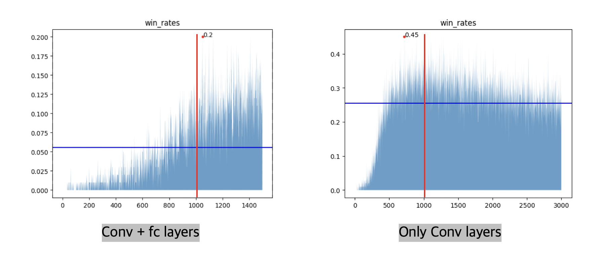
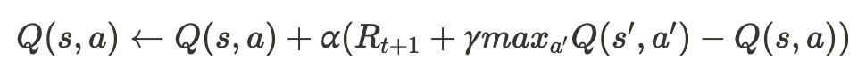

<!-- 한국어 콘텐츠 -->

  
## 02. DQN
### Net 
CNN은 공간상의 정보를 인식할 수 있기 때문에 이미지 인식에 유리하다. 지뢰찾기의 state 또한 수와 주변부 사이의 패턴이 중요하기 때문에 CNN 신경망이 적합하다 판단했다. 패딩과 합성곱 층만을 이용하는 두 가지 아이디어에서 성능 향상이 이뤄졌다. 

#### 1. CNN with Padding
합성곱 신경망에서 패딩은 이미지 크기 손실을 막고 가장자리를 더 잘 인식하게 만들어준다. 가장자리 값이 중앙이나 다른 영역에 비해 중요도가 낮을 수 있는 일반적인 사진과는 달리, 지뢰찾기에서 가장자리는 중앙과 동일하게 중요한 정보값을 갖고 있다. 커넬이 state의 모든 타일을 동일하게 탐색하여 정보를 얻어가게 만들기 위해 첫번째 합성곱 layer에서는 2단의 패딩을, 나머지 layer에서는 1단의 패딩을 적용했다. 또한 이미지의 크기가 유지되었기 때문에 9*9라는 작은 state에서 4층 이상의 다층 신경망을 적용할 수 있었다. 그 결과 패딩이 없는 모델에서는 학습이 거의 진행되지 않았던 것에 반해, 성공률이 높아지며 학습 양상을 보였다. 

#### 2. CNN only with conv layer
[@ryanbaldini](https://github.com/ryanbaldini/MineSweeperNeuralNet)의 모델을 통해 합성곱 신경망만을 사용하는 아이디어를 얻었다. 추가적인 합성곱 신경망을 쌓지 않고 전연결 신경망을 삭제하는 것만으로 100%p 이상의 성능 상승을 보였다. 명확한 원인을 규정할 수는 없었지만 합성곱 층에서 뽑아낼 수 있는 정보들이 전연결 신경망을 거치며 오히려 꼬여 영양가를 잃는 것이 아닐까라는 가설을 세웠다. 

```python
class Net(nn.Module):
    def __init__(self, input_dims, n_actions, conv_units, in_channels=1):
        super().__init__()
        self.conv1 = nn.Conv2d(in_channels=in_channels, out_channels=conv_units, kernel_size=(3,3), padding=2)
        self.conv2 = nn.Conv2d(in_channels=conv_units, out_channels=conv_units, kernel_size=(3,3), padding=1)
        self.conv3 = nn.Conv2d(in_channels=conv_units, out_channels=conv_units, kernel_size=(3,3), padding=1)
        self.conv4 = nn.Conv2d(in_channels=conv_units, out_channels=conv_units, kernel_size=(3,3), padding=1)

        self.flatten = nn.Flatten()

        fc_size = conv_units * (input_dims[-1]+2) * (input_dims[-2]+2)

        self.fc = nn.Linear(fc_size, n_actions)

    def forward(self, x):
        # conv area
        x = F.relu(self.conv1(x))
        x = F.relu(self.conv2(x))
        x = F.relu(self.conv3(x))
        x = F.relu(self.conv4(x))

        x = self.flatten(x)
        # flatten area
        x = self.fc(x)

        return x
```

### Replay Memory 
추측 가능할 만큼 타일이 까지지 않는다면 사람이 게임을 플레이해도 찍을 수 밖에 없다. 때문에 추측이 불가능할 정도로 적게 타일이 까여진 state는 학습에 있어 주요한 데이터가 아니라 판단했다. replay memory에 저장할 타일의 기준을 세우기 위해 직접 지뢰찾기를 플레이하며 추측을 통해 풀 수 있다 판단한 시점에 까여진 타일의 개수를 세었다. 그 결과 30개의 표본에서 평균 18개라는 수치를 얻을 수 있었다. 이를 바탕으로 에피소드를 진행하며 18개 미만으로 까여진 state는 replay memory에 저장하지 않는 방식으로 replay memory를 수정했다.  

이 방식은 구현 초기 초반 학습에 강점이 있어 특정 신경망 및 보상 체계가 잘 작동하는지 확인하는데 용이했다. 하지만 수 차례의 리팩토링과 보상을 변경하는 과정에서 강점이 흐려져 바닐라 리플레이보다 떨어진 성능을 보였다. 따라서 최종적으로 가장 높은 승률을 지닌 모델을 찾을 때는 기능을 사용하지 않았다. 기능을 사용한 모델의 경우, `[RM 수정 버전]`이라 명시해뒀다. 

### DQN 로직 구현
> **vector type / scalar type Q-learning**
  
- **DQN 알고리즘** 


DQN 알고리즘을 두 가지 버전으로 구현했다. 먼저 vector type은 [@pythonprogramming.net](https://pythonprogramming.net/training-deep-q-learning-dqn-reinforcement-learning-python-tutorial/?completed=/deep-q-learning-dqn-reinforcement-learning-python-tutorial/)의 코드를 참고했으며, 텐서플로우에서 파이토치로 변환할 때 불필요한 구현부를 최소화시켜 속도를 향상시켰다. 이 코드는 state를 신경망에 넣었을 때 나오는 전체 Q 값을 예측값으로 사용한다. 타겟값 또한 예측값의 Q값을 복사한 후, 타겟 신경망의 최대 Q 값을 기존의 action이 있는 위치에 넣는 방식으로 구현되었다. scalar 타입은 [@pytorch DQN 공식문서](https://pytorch.org/tutorials/intermediate/reinforcement_q_learning.html)를 참고해 구현했으며, 예측값은 신경망에서 구한 Q 값들 중 a에 해당하는 값이고 타겟 값은 타겟 신경망에서 얻은 Q 값 중 가장 큰 값이다. 

벡터 타입의 DQN과 스칼라 타입의 DQN의 차이점은 loss값이다. MSE 기준으로 생각했을 때, 벡터 타입의 DQN은 하나의 숫자만 다르고 나머지가 전부 동일한 두 벡터를 비교하기 때문에 스칼라와 예측값과 타겟값 사이의 오차제곱과는 동일하다. 하지만 MSE loss는 오차제곱 값의 평균을 다루기 때문에, 벡터 타입의 DQN이 스칼라 타입보다 loss 값이 작다.  

이론적으로는 스칼라 타입이 더 적합한 방법이라 생각하지만, 벡터 타입 또한 큰 문제는 없다 판단해 두 방식을 학습에 전부 다 이용해보았다. 그 결과, 전부 같은 조건에서 학습을 진행했을 때 스칼라 타입이 벡터 타입에 비해 이미 까진 타일을 여러 번 눌러 전체 에피소드의 스텝 수가 증가하고, 총 리워드가 감소하는 모습이 더 강하게 오래 동안 발생했다. 

이를 통해 낮은 loss값이 더 빠른 수렴에 도움을 줄 수 있다 생각해 초기 수렴이 빠른 벡터 타입을 이용해 대부분의 학습을 진행했다.  
  



<!-- 영어 콘텐츠 -->


To be continue...



<div id="content-ko" class="lang-content" data-lang="ko">
  {{ ko_content | markdownify }}
</div>

<div id="content-en" class="lang-content" data-lang="en" style="display: none;">
  {{ en_content | markdownify }}
</div>

