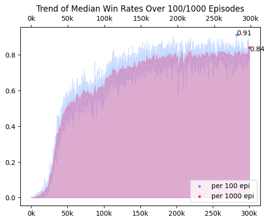
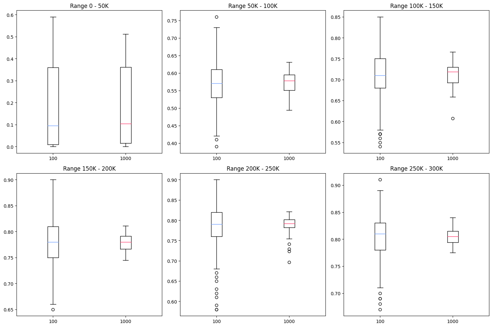
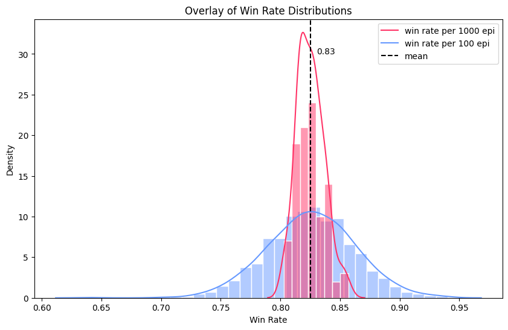

## 03. Train / Valid / Test
### Train : 학습 지표 선택 
> centrality : mean, median, mode   

줄어드는 loss를 통해 학습 상황을 볼 수 있는 딥러닝 학습과 달리, 강화학습은 두 신경망에서 만들어진 target-pred 사이 오차가 크지 않아 loss만으로는 학습 상황을 파악할 수 없다. 따라서 지뢰찾기에서 주요 지표가 될 수 있는 **승률, 에피소드 별 step 수, 에피소드 별 reward**를 특정 간격(100 / 1000)마다 출력해 학습 경향을 파악했다. 에피소드 별 step 수와 총 reward의 경우, 구간 동안 에피소드를 대표하는 통계량으로 중앙값을 선택했다. 중심성을 나타내는 통계량에는 평균, 중앙값, 최빈값이 있고 일반적으로 평균이 가장 많이 사용된다. 지뢰찾기 테스크는 같은 곳을 여러번 누르는 행동, 추론을 할 수 없었던 상황에서 지뢰를 밟는 행동, 찍어야만 하는 행동이 발생하기 때문에 랜덤성이 강한 테스크다. 이처럼 강한 랜덤성을 띄는 테스크에서는 극단값이 자주 발생함으로, 극단값에 영향을 많이 받는 평균은 테스크에 적합한 통계량이 아니라 판단했다. 최빈값은 극단값에 영향을 많이 받지는 않지만, 전체적인 경향을 보기에는 중앙값이 더 좋은 통계량이라 판단했다.  

### Valid의 중요성 
최고 성능을 가진 모델을 찾기 위해서는 학습 중간 valid가 필수적이다. 학습 중 출력되는 지표는 동일한 모델에서 나온 결과물이 아니다. 이 프로젝트의 경우, step마다 학습이 일어났기 때문에 100 에피소드에 평균 15 step이라면 학습의 출력물은 총 1500개 모델의 결과물이다. 따라서 학습 지표만을 기준으로 최고 승률이 찍힌 순간의 모델을 저장한다면, 저장된 모델은 최고 승률을 가진 구간의 말단 모델일뿐, 최고 승률을 보일 것이라 기대할 수 없다. 또한 지뢰찾기는 랜덤성이 강한 테스크기 때문에 성능이 좋은 모델일지라도 운에 의해 게임이 조기 종료될 수 있다. valid는 학습 중간에 특정 모델을 받아 테스트를 진행하기 때문에 놓칠 수 있는 여러 모델들을 점검하게 만든다. 

최고 승률을 놓치지 않기 위해 여러 기반 코드를 만들되, valid가 과해 학습 속도가 과하게 저하되지 않도록 했다. 학습 중 최고 승률을 찍었을 때를 기점으로 하며, 찍은 순간의 터미널 모델(`best_model_train`)을 valid했고, 이후 10 에피소드마다 텀을 주고 10번 valid를 진행했다(`best_model_valid`). 또한 추가적으로 승리한 모델을 덮어씌우며 저장해 가장 마지막에 승리한 모델(`best_model_successed`)과 학습에서 가장 마지막 모델(`final_model`)을 저장했다. 

### Valid에서 적절한 표본 수 
학습의 경향과 학습 이후 사후적으로 진행한 test를 통해 적절한 표본 수를 정했다. 
#### 학습 경향
학습에서 100 에피소드마다 스텝, 총보상의 중앙값과 승률을 출력했다. 100 기준으로 학습을 평가하는 것은 출력 간격이 짧아 학습 상황을 빠르게 판단할 수 있다는 장점이 있다. 하지만 분산이 커 valid/test와 train에서의 최고 승률 사이에 오차가 심하다는 단점이 존재했다. 분산이 낮은 추정량을 얻기 위해, 학습을 평가하는 기준을 1000으로 늘려 같은 학습 상황을 시각화했다. 
- 전체 승률을 시간에 따라 시각화 
  

- 시간대를 6개로 나눈 뒤(5만 단위), boxplot으로 퍼진 정도를 시각화 
  

극단값에 영향을 100 기준에 비해 덜 받아 분산이 적었으며, 실제 모델과 학습의 최고 성능 사이의 오차도 유의미하게 적었다. 이 두 개의 자료를 통해 분산이 큰 지뢰찾기 학습에서 분산이 작은 불편 추정량을 얻기 위해서는 표본을 100개보다 1000개를 기준으로 하는 것이 효과적임을 알 수 있었다.

#### 테스트 시뮬레이션 
- 고정된 모델로 100 에피소드일 때의 승률, 1000 에피소드일 때의 승률을 시뮬레이션함
- 100 에피소드는 총 1000회 진행, 1000 에피소드는 총 100회 진행, 공통 10만 에피소드 

  

| Test Sample Size | mean (± sd) |  min / max | 
| - | - | - | 
| 100 | 0.828 (± 0.035) | 0.74 / 0.90 | 
| 1000 | 0.825 (± 0.011)| 0.803 / 0.857 | 

100 에피소드에서의 승률이 표본 수가 더 많아 완만한 정규분포의 형태를 띄고 있지만, 분산이 1000 에피소드보다 훨씬 크다. 반대로 1000 에피소드의 경우, 분산이 현저하게 작으며 min-max 값 또한 80-85% 사이로 오차 범위가 적다. 

구현한 valid는 test와 달리 고정된 모델의 승률을 여러 번 확인하지 않고 한 번의 검증으로만 모델을 평가한다. 한 번의 검증에서 얻은 추정치가 불편향 추정치에 근접해야 하기에, 분산이 작은 1000개에서의 승률이 100개에서보다 적합하다. 
