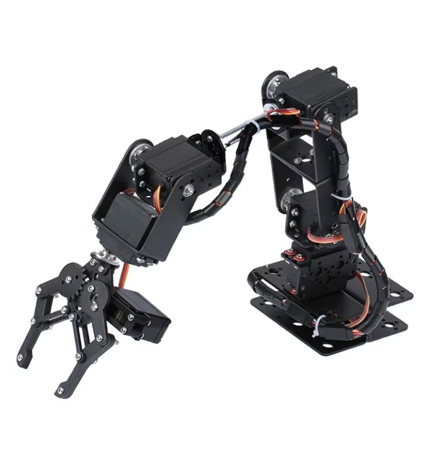
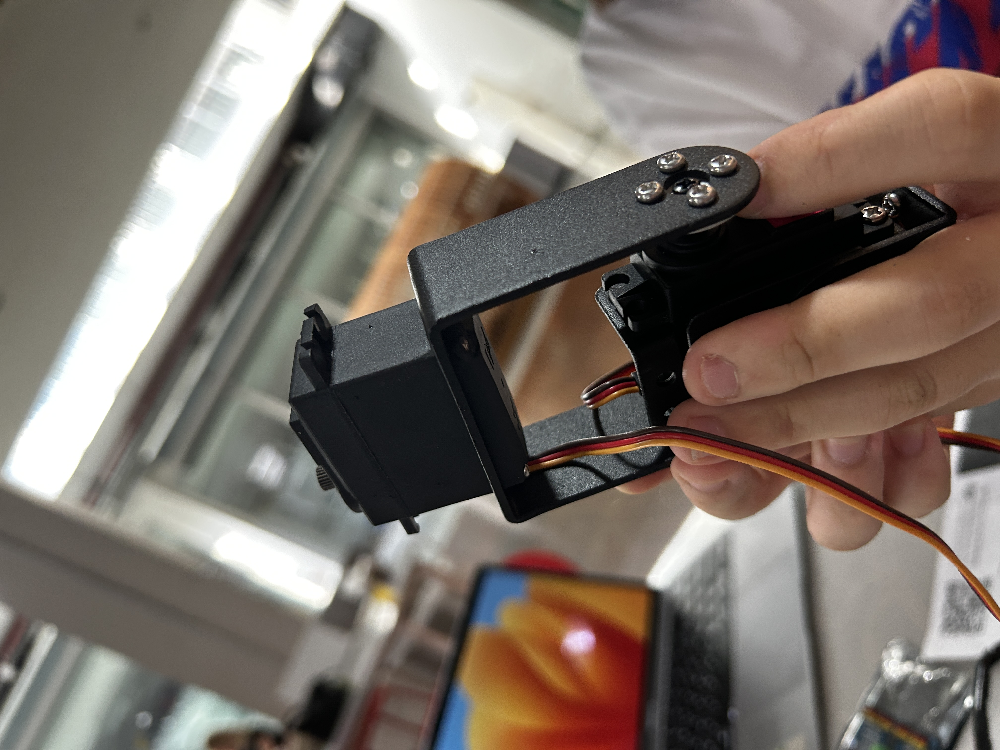
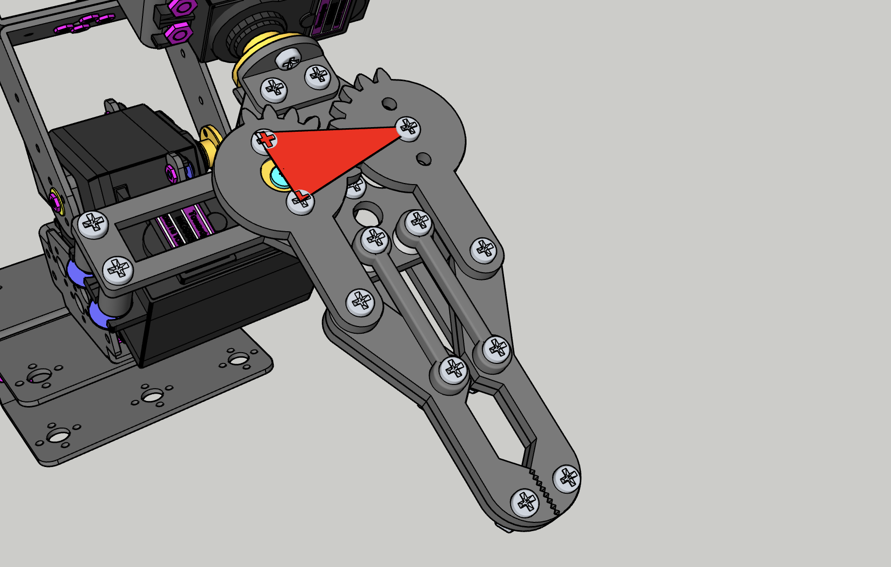
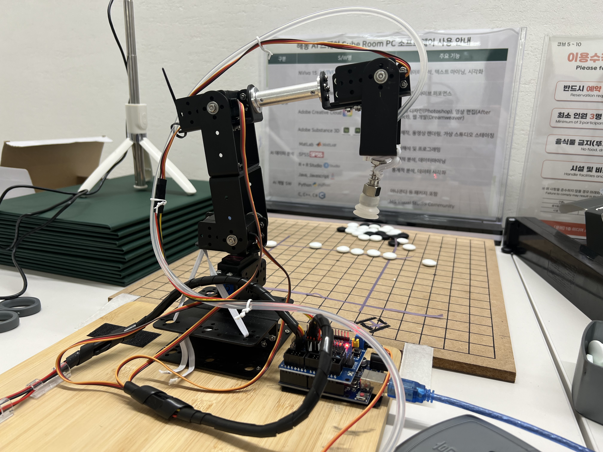

<!-- 한국어 콘텐츠 -->

  


로봇팔 도면 정하기
본체 조립
문제 01. 부품이 제대로 들어가지 않았다.
문제 02. 집게 악력이 너무 약하다.  
문제 03. 바둑돌을 집기에 집게는 적절하지 않다. 



## 로봇팔 도면 정하기 
오목을 두는 로봇으로 `로봇팔`을 정한 뒤, 여러 가지 로봇팔 도면 및 키트를 찾았다. 레퍼런스 선정 기준은 다음과 같다.    

1. 판 전체에서 자유자재로 움직일 수 있을만큼 팔 가동 거리가 길어야 한다. 
2. 가격이 합리적이어야 한다. (ex 3D 프린팅 비용으로 15만원 이상 지출은 부적절)
3. 시뮬레이션을 위해 stl 파일이 존재해야 한다. 

최종적으로 선정된 로봇팔 키트는 
[@ 6 DOF 로봇팔 (알리익스프레스)](https://ko.aliexpress.com/item/1005007386559678.html?spm=a2g0o.productlist.main.15.76b4RakaRakaND&algo_pvid=85321348-9fe0-4f8b-addd-296b5d50c8f3&aem_p4p_detail=202409102006354683620301111830002281303&algo_exp_id=85321348-9fe0-4f8b-addd-296b5d50c8f3-7&pdp_npi=4%40dis%21KRW%2127469%2125650%21%21%21141.96%21132.56%21%402141112417260239956742894ea51d%2112000040533573588%21sea%21KR%210%21ABX&curPageLogUid=hGIF7raV9P0Z&utparam-url=scene%3Asearch%7Cquery_from%3A&search_p4p_id=202409102006354683620301111830002281303_8)다. 
3D 프린팅으로 로봇팔을 뽑으면 stl 파일이 존재한다는 장점이 있지만, 판 전체에서 움직일 수 있는 크기의 로봇팔은 과도하게 프린팅 단가가 비싸 제외되었다. 간단하게 아두이노 조립과 나무 막대기만으로 로봇팔을 구성하고 조정하는 레퍼런스도 존재했지만, 내구성이 약해 안정적인 제어가 어려워 제외되었다. 선정된 레퍼런스의 경우, 가격 면에서 엄청난 강점을 가졌고 대중적인 키트이기에 많은 조립 영상을 갖고 있었다. 또한 판매자가 3D 파일을 제공하고 있었기에 필요한 모든 조건을 충족했다. 판매자에게 받기 전, 구글링을 통해 해당 로봇팔의 스케치업 도면을 얻었고 각 부품을 stl 파일로 변환했다.  
- 스케치업 파일 링크 : [바로가기](https://3dwarehouse.sketchup.com/model/e652c8d7-eef4-4c61-b5f7-9ef8b67c9da8/YFRobot-6-DOF)

#### 문제 01. 부품이 제대로 들어가지 않았다.

설계 오차인지, 서보모터를 부품에 낄 수 없었다. 서보모터가 완전히 분해하기가 어려운 구조라 서보모터의 플라스틱 몸체와 로봇팔 알루미늄 부품 일부를 사포로 갈아내 문제를 해결했다. 

- 제대로 부품이 들어간 모습

#### 문제 02. 집게 악력이 너무 약하다. 
<table>
  <tr>
    <td>
        <video controls width="300">
        <source src="../assets/images/Omok/Robot/IMG_5380.mp4" type="video/mp4" />
        </video>
    </td>
    <td>
        <video controls width="300">
        <source src="../assets/images/Omok/Robot/IMG_5381.mp4" type="video/mp4" />
        </video>
    </td>
    </tr>
</table>

부품 조립을 끝낸 후 악력 테스트를 위해 집게를 제어하는 서보모터를 간단히 프로그래밍했다.  
위 동영상과 같이 톱니가 제대로 맞물리지 않아 찹쌀 과자처럼 매우 가벼운 물체조차 들지 못하며, 두 톱니를 제대로 맞춰도 물체를 집게에 물리는 즉시 톱니가 틀어지는 문제가 있다는 것을 확인할 수 있었다.  

구체적으로 파악한 문제 원인은 다음과 같다.  

1. 톱니와 톱니 사이의 거리가 다소 넓다. 
2. 왼쪽 집게손은 모터로 제어되지만, 오른쪽 집게손은 그렇지 않기에 톱니가 제대로 맞물리지 않으면 힘을 제대로 받을 수 없다. 
3. 오른쪽 집게손 아래에 작은 원형 베어링이 있는데, 무게 중심이 맞지 않는다. 
4. 오른쪽 집게손의 무게중심이 맞지 않아 외부적인 힘이 있어야만 톱니가 제대로 맞는다. 
5. 두 집게의 높이가 맞지 않는다. 

1-4번은 모두 동일한 문젠데, 고무줄을 이용해 무게중심을 강제로 맞추고, 톱니 사이가 벌어지지 못하게 조여 문제를 해결했다.  
5번 문제의 경우, 여러 번 부품을 조였다 풀었다가 하는 과정 속에서 균형을 맞출 수 있었다. 
<table>
  <tr>
    <td>
        <video controls width="300">
        <source src="../assets/images/Omok/Robot/improved.MP4" type="video/mp4" />
        </video>
    </td>
    <td>
        
    </td>
    </tr>
</table>

그 결과, 가벼운 찹쌀 과자도 들지 못하던 로봇팔이 두유를 안정적으로 들고 내려놓을 수 있을 정도로 악력이 높아졌다. 하지만 부품을 강제로 조이다보니 소음이 증가했다. 

#### 문제 03. 바둑돌을 집기에 집게는 적절하지 않다. 
마찰을 높이면 아무리 바둑돌이라도 집기 어렵지 않으리라 생각했다. 하지만 실제로 바둑돌을 집는 것은 각도가 정말 정확하지 않으면 불가능했다. 이 문제를 해결하기 위해 end-effector를 흡입형으로 바꾸었다. 이를 위해 6DOF의 로봇팔 중 집게 부분을 다루던 두 개의 관절을 제외했고 최종적으로 4DOF에 흡입장치를 단 형태가 되었다.   



<!-- 영어 콘텐츠 -->


To be continue...



  {{ ko_content | markdownify }}

  {{ en_content | markdownify }}

