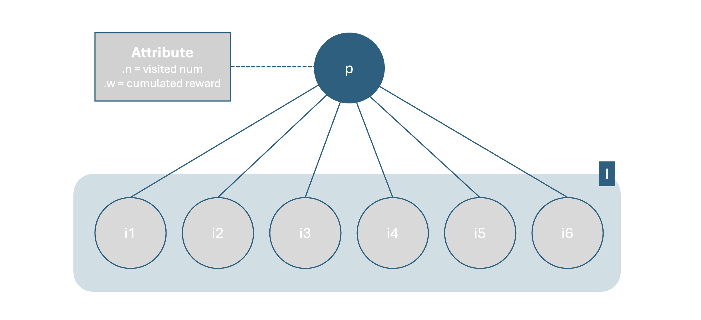
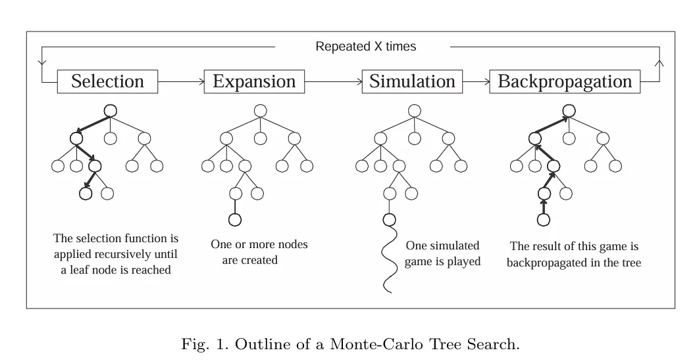
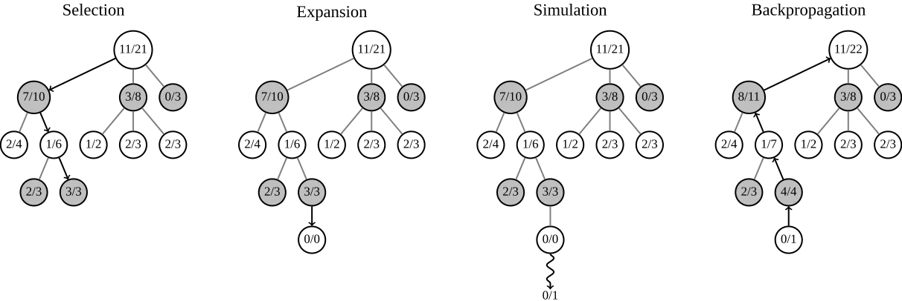

<!-- 한국어 콘텐츠 -->

  
## Monte Carlo Tree Search(MCTS)

> Monte Carlo (Statistical Simulation Method) + Tree Search  

몬테카를로 트리 탐색은 확률적 시뮬레이션을 활용해 효과적인 트리 탐색을 하는 방법론이다. 불확실한 상황에서 명시적인 평가 함수 없이 시뮬레이션으로 얻은 경험적 데이터만으로 합리적인 의사 결정을 내리며, 틱택토나 바둑과 같은 턴제 게임에서 많이 활용되는 전략이다. 

## MCTS의 지표
MCTS는 시뮬레이션을 사용해 각 노드의 가치를 구한다. 이때 노드의 가치는 각 노드를 거친 시뮬레이션의 수 $n$와 누적 보상 $w$로 표현한다.  


## 기본 Notation
  
### 노드에 관하여 
- $p$ : 부모 노드  

- $I$ : $p$ 와 연결된 자식 노드 집합 

- $i ∈ I$ : 자식 노드 $i$  

- $k$ : 자식 노드 중에서 선택된 자식 노드  

### 노드의 속성 
- $n_i$ : 노드 $i$를 시뮬레이션에서 방문한 횟수  

- $w_i$ : 노드 $i$가 시뮬레이션 상에서 구한 보상의 누적합

## MCTS 가치 평가 구조
  
  
MCTS는 `1. Selection -> 2. Expansion -> 3. Simulation -> 4. Backpropagation`을 반복하며 트리의 노드 별 가치를 채워나간다. 이때 이 4가지 단계는 엄밀하게 순차적으로 진행되지 않으며, 상황에 맞게 순서는 재구성된다.  

1. **Selection** : 부모 노드에서 자식 노드를 선택한다. 이때 선택은 가장 가치가 높은 것을 기준으로 한다. 

2. **Expansion** : 부모에서 자식 노드를 새로 추가한다. 이때 추가되는 자식 노드의 수는 기본적으로 하나이지만, 상황에 따라 연속으로 expansion을 진행해 동시에 여러 개가 생기는 것처럼 보일 수 있다.  
    - 추가된 자식 노드의 속성 : $n_i$, $v_i$ = 0, 0  

3. **Simulation(PlayOut)** : 노드의 가치를 찾아내기 위해 시뮬레이션을 진행한다. 틱택토 상황에서는 승리했을 때 +1, 패배했을 때 -1, 비겼을 때 0을 최종 값으로 준다.  

4. **Backpropagation** : 시뮬레이션을 통해 얻어낸 각 노드의 속성(결과값, 노드의 방문 횟수 += 1)을 업데이트한다. 

- 2인 플레이 게임 상황에서 한 시뮬레이션 결과가 노드마다 다르게 받아들여진다. 흰색 플레이어가 패배했다고 가정할 때, 검은색 플레이어는 승리한다. 따라서 가치를 업데이트할 때 플레이어의 변화를 주의해야 한다. 


## MCTS Selection의 기준 : UCT1
### UCT1 (Upper Confidence bounds applied to Trees)
UCT1는 충분히 탐험되지지 않은 경로와 좋다고 판단된 경로 사이의 균형을 맞추는 알고리즘이다. MCTS는 시뮬레이션으로 가치를 구하기 때문에, 각 노드의 방문 수가 충분하지 않다면 노드의 가치를 평가하기 어렵다. 이때 탐험 기능이 없다면, 탐험되지 않은 노드가 더 좋은 노드임에도 처음 탐험이 된 노드만 선택되기 때문에 초기값에 의해 편향될 수 있다. (Multi-armed Bandit 문제)    

이를 위해 UCT1은 이미 좋다고 판단 내려진 가치를 사용하는 **활용**과 해당 노드가 충분히 탐험되었는지 확인하는 **탐색** 두 지표를 사용한다.  

### 수식
- **child node 각각의 가치 계산**  


-  **전체 child nodes 중 select 기준**


$C$ : 탐험의 정도를 조절하는 파라미터로, 알파고에서 사용된 $\sqrt{2}$가 가장 대중적으로 많이 사용된다. 

<br>   

**활용**     
$E(win|k,p) = \frac{w_{k,p}} {n_k}$ 은 경험적으로 구해진 노드의 가치며, 각 노드의 좋고 나쁨을 판단할 수 있다.  

**탐색**  
1. $C\sqrt{\frac{log(n_p)}{n_i}}(n_i \neq 0)$는 부모 노드의 방문 횟수와 자신의 방문 횟수로 정해진다. 만약 노드 i의 방문 횟수가 적은데 부모 노드의 방문 횟수가 크다면 형제 노드들보다 현재 노드 i의 방문 횟수가 적다는 의미이므로 높은 탐색 우선순위를 갖게 된다.  

2. 만약 자식 노드의 방문 횟수가 0 $(n_i = 0)$이라면, 최우선 탐색 대상이 된다. 

## MCTS를 통한 행동 선택 
MCTS의 가치평가 시기에는 최대 UCT1 값을 가지는 자식 노드를 우선적으로 선택했다. 하지만 최종적인 행동 선택은 최다방문 수를 기준으로 한다. UCT1 값은 충분한 양의 평가 및 탐색이 이뤄졌을 때, 탐색의 영향력은 줄고 활용 부분의 영향력이 커진다. 활용 부분의 영향력이 커지면, 유리하다고 판단되는 행동이 더 많은 지명을 얻게 되고 방문 수가 형제 노드보다 늘어나게 된다. 따라서 최다 방문 수를 기준으로 한 선택은 합리적이다. 

## MCTS : code
[@ 틱택토](https://github.com/Tonnonssi/tic_tac_toe.git)에 정리되어 있다. 
```
/code/mcts/ # 코드 위치
```

`Node`가 MCTS 구현의 핵심이며, `Agent`에 걸쳐서 구현되어 있다.  

#### 출처 
1. [Advanced 4. Monte Carlo Tree Search _ MIT OpenCourseWare](https://www.youtube.com/watch?v=xmImNoDc9Z4)
2. [https://dke.maastrichtuniversity.nl/m.winands/documents/pMCTS.pdf](https://dke.maastrichtuniversity.nl/m.winands/documents/pMCTS.pdf)



<!-- 영어 콘텐츠 -->


To be continue...



<div id="content-ko" class="lang-content" data-lang="ko">
  {{ ko_content | markdownify }}
</div>

<div id="content-en" class="lang-content" data-lang="en" style="display: none;">
  {{ en_content | markdownify }}
</div>

