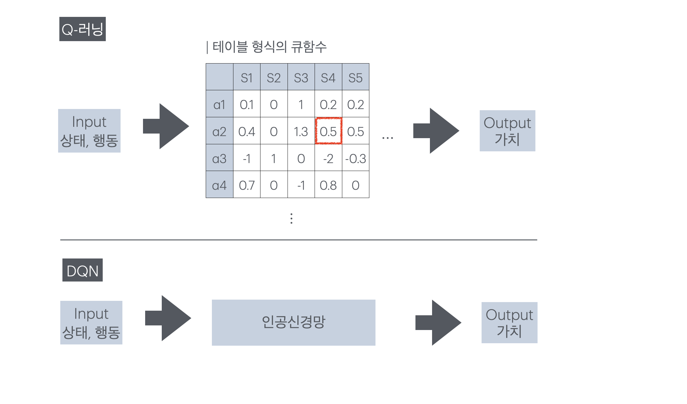
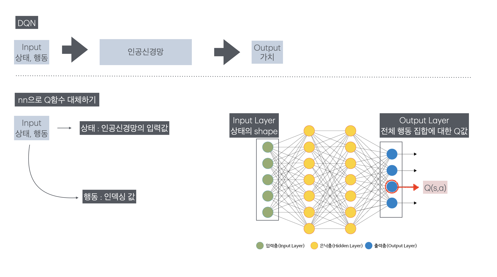
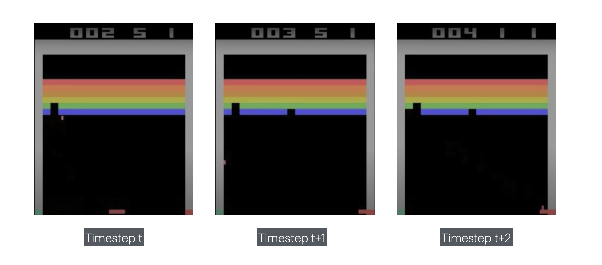
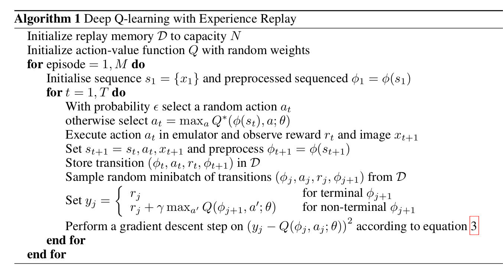
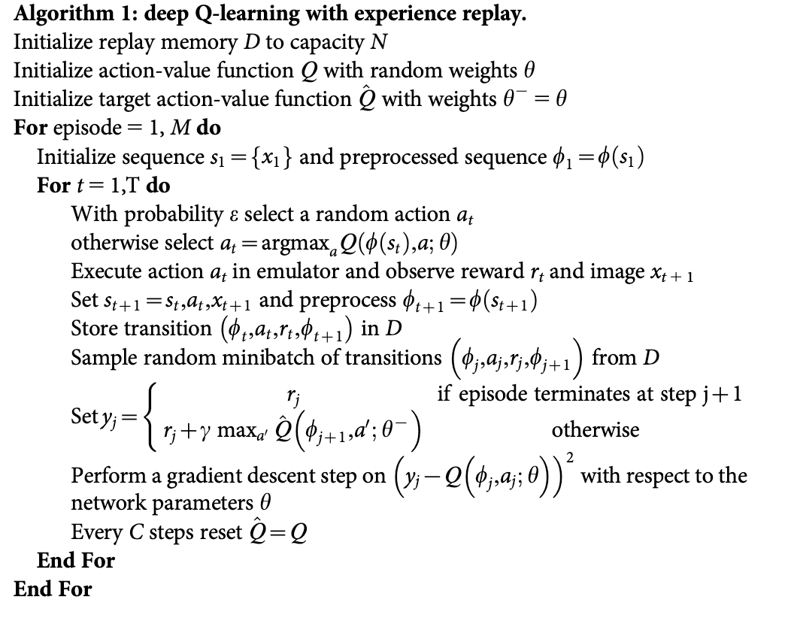
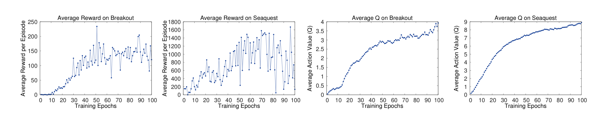
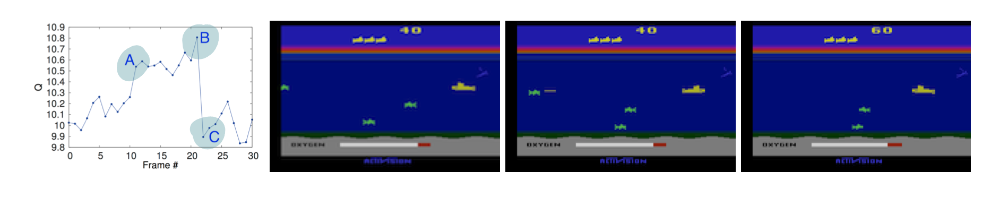

<!-- 한국어 콘텐츠 -->

  

### 00. DQN 논문의 의의  

**| 원문 바로가기** 
1. [Playing Atari with Deep Reinforcement Learning(2013)](https://arxiv.org/pdf/1312.5602)  
2. [Human-level control through deep reinforcement learning(2015)](https://daiwk.github.io/assets/dqn.pdf)  


2013년 딥마인드가 발표한 논문인 “Playing Atari with Deep Reinforcement Learning”은 강화학습의 적용 범위를 크게 확장하는 데 기여했다. 강화학습은 모든 상태 간의 관계를 미리 정의할 필요가 없다는 점에서 다이나믹 프로그래밍이나 의사결정트리의 문제를 해결할 수 있었다. 다만, 여기에는 게임, 이미지 처리, 로봇 제어와 같은 고차원 상태 공간을 스스로 처리할 수 없다는 한계가 존재했다. 이를 보완하기 위하여 딥마인드는 고차원 상태 공간을 학습할 수 있도록 상태를 입력받아 가치를 출력하는 가치 함수를 인공신경망으로 대체하였고, 그 결과 보다 복잡한 환경에서까지 강화학습의 활용도를 확장시켰다.  

2015년 딥마인드가 발표한 논문 "Human-level control through deep reinforcement learning"은 기존 DQN(2013)이 해결하지 못했던 강화학습-딥러닝 사이의 격차를 줄였다. 기존 DQN은 하나의 Q함수를 가지고 예측값과 타겟값을 만들었다. 동일한 신경망에서 만들어진 타겟값을 목표로 하기에 학습 수렴이 제대로 일어나지 않았다. 또한 타임스텝마다 학습이 진행되어 파라미터가 변화해 같은 상태-행동에 대한 타겟값의 변화가 너무 빈번했다. 이는 명확한 타겟값을 주지 못해 학습의 불안정성을 높였다. 2015년 논문에서는 이 문제를 해결하고자 타겟 신경망이라는 새로운 개념을 도입했다. 이 신경망을 통해 강화학습-DQN(2013)이 갖고 있었던 변화하고 불명확한 타겟값이라는 문제를 줄였으며, 인간에 필적하는 수준의 아타리 플레이 에이전트를 만드는데 성공했다. 

###  Deep Q-learning(DQN)

DQN은 Q-러닝의 가치 함수를 인공신경망으로 대체했으며 강화학습과 딥러닝이 접목된 사례 중 유의미한 성과를 낸 첫 번째 방법론이기에 의미가 깊다. 딥마인드는 강화학습과 딥러닝의 구조적 차이를 인지하고 인공신경망으로 Q함수를 근사할 때 발생할 문제를 최소화하고자 리플레이 메모리를 도입했다. 또한 Q-값이 발산하는 문제를 억제하고 학습을 안정화시키기 위해 타겟 신경망과 행동 신경망을 분리했다. 

### 01. Q-러닝 vs DQN 

Q-러닝은 테이블 형식의 강화학습 방법론으로, 모든 상태-행동 쌍에 대한 가치를 계산해 저장해야 한다. 이 방식은 환경의 복잡도가 낮아 상태가 단순하고 행동 집합의 크기가 한정적일 때에는 계산이 가능하지만, 그렇지 못한 환경에서는 적용이 불가능하다. DQN은 테이블로 저장되는 Q-러닝의 가치 함수를 인공신경망으로 치환해 문제를 해결한다. 이 방식은 모든 상태-행동에 대한 가치 테이블을 채우지 않고 가치를 근사할 수 있기 때문에 더 복잡한 환경에서 강화학습을 사용할 수 있게 도와준다.  




- **Q러닝 수식**  

$$Q(s,a) \leftarrow Q(s,a) + \alpha \left(R_{t+1} + \gamma \max_{a^{\prime}} Q(s^{\prime}, a^{\prime}) - Q(s, a)\right) $$

- **DQN 수식 (1차)**  

$$Q(s,a) \leftarrow Q(s,a) + \alpha \left(R_{t+1} + \gamma \max_{a^{\prime}} Q(s^{\prime}, a^{\prime}|\theta) - Q(s, a|\theta)\right) $$

이때 $\theta$는 인공신경망의 파라미터를 의미한다. 

#### 01-1. 큐함수를 근사하는 인공신경망 이해
큐함수에서는 상태와 행동이 모두 입력값으로 함수 안에 들어갔지만 DQN의 큐함수를 근사한 인공신경망의 입력값은 상태 하나다. DQN의 인공신경망은 입력층으로 상태를 받고 출력층에서 전체 행동 집합에 대한 Q값을 일괄로 출력한다. 이때 행동은 인덱스로, 전체 행동 중 자기 자신을 찾아 값을 빼온다. 
  

| 입력 값 | 입력 층 | 은닉 층 | 출력 층 | 출력 값 |
| - | - | - | - | - | - | 
| 상태 | 상태의 형태 | ... | 전체 행동에 대한 Q 값 | 행동으로 인덱싱한 Q 값 | 


### 02. DL + RL 접목의 어려움 
딥러닝과 강화학습을 결합하려는 시도는 이전에도 여러 차례 있었지만, 강화학습은 딥러닝과 달리 명확한 타겟값이 없다는 점에서 어려움을 겪었다. 딥러닝은 이미 라벨링된 정답이 주어지는 지도 학습 방법론이다. 그러나 강화학습은 새로운 정책이 세워지거나 가치 함수가 업데이트됨에 따라 타겟값이 변한다. 또한 타겟값은 현재 상태와 행동 쌍 이후 종결까지 총 보상의 합으로 계산되는데, 보상은 현재 행동으로 인한 실질적인 값이 즉각적으로 반영되지 않고 잡음이 많다는 단점이 있다.  게다가 딥러닝은 데이터 사이의 독립을 전제로 진행하지만 강화학습의 데이터는 타임 스텝 순으로 데이터를 받고, 변화하는 정도가 적어 상태 사이의 상관이 높아 딥러닝의 방법론을 적용하기 어렵다.  

변화하는 타겟값과 보상의 여러 문제점은 강화학습이 지닌 고유의 특성이다. 이 두 가지 특성들은 강화학습의 학습 편차를 높여 안정성을 낮추는 주된 원인이다. 본 논문은 이런 한계를 완전히 극복해내진 못했지만, 리플레이 메모리를 도입해 시간에 따른 데이터 상관성 문제를 없애 데이터 사이의 독립성을 확보했으며, 타겟값 데이터의 분포를 안정시켰다. 

### 03. 리플레이 메모리(Replay Memory / Experience Replay)
리플레이 메모리는 매 타임스텝마다 ( $ s, a, r, s'$ ) 데이터가 저장되며, 일정 개수 이상 채워진 후 학습이 진행된다. 학습이 시작되면 랜덤으로 `batch_size`만큼의 데이터를 꺼낸다. 최대 용량이 정해져 있어 수용 가능 범위를 넘기면 가장 오래 전에 저장된 데이터부터 사라지는 `Queue` 자료 구조를 따른다.  
- 데이터를 랜덤으로 샘플링한다는 것은 각 데이터가 균등 분포를 따른다는 것과 동일  

$$ D =(s, a, r, s') \sim \text{Uniform} $$

#### 03-1. 시간에 따른 데이터의 상관성 제거 
  
모든 데이터의 독립을 전제로 하는 딥러닝과 달리, 강화학습의 데이터는 시간에 따른 상관도가 높다. 따라서 데이터를 시간 순서대로 입력받으면 학습이 제대로 되지 않아 로컬 미니마에 빠질 위험이 커진다. DQN의 학습은 리플레이 메모리에 저장되어 있는 다양한 타임스텝의 데이터를 랜덤으로 추출하기 때문에 시간적 연속성이 깨지고, 데이터 셋의 독립성을 보장할 수 있다. 

#### 03-2. 타겟 데이터 분포 안정화 
강화학습은 현재의 선택에 따라 이후의 행동들이 결정된다. 통계적으로 표현하자면, 현재의 행동이 이후 상태-행동에 대한 분포를 결정짓는다. 따라서 강화학습의 타겟값은 변화하며, 그 분포 또한 현재 행동에 종속된다. 하지만 딥러닝은 고정된 타겟값이 존재하기 때문에 고정된 분포를 전제하기 때문에, 인공신경망을 강화학습에 효과적으로 적용하기 위해서는 안정된 타겟값의 분포가 필요하다. 리플레이 메모리는 데이터를 랜덤으로 추출하기 때문에 일반 강화학습 방법론보다 일반화되고 견고한 행동 분포를 얻을 수 있다. 

#### 03-3. 오프폴리쉬 
리플레이 메모리는 데이터의 상관성을 제거하고, 데이터의 행동 분포를 견고하게 만든다는 장점이 있다. 하지만 빈번하게 가치 함수가 업데이트되기 때문에, 리플레이 메모리 안에 들어 있는 표본들은 각기 다른 알고리즘에 의해 만들어진다. 따라서 리플레이 메모리를 사용해 강화학습을 구현하려면 목표 정책과 행동 정책이 구분되는 오프폴리쉬 방식을 사용해야 한다. 


### 04. 타겟 신경망
2015년 추가로 등재한 DQN 논문에는 타겟 신경망이라는 새로운 개념이 등장한다. 타켓 신경망은 타겟값을 만들어내기 위해 존재하는 별도의 Q함수를 근사한 인공신경망으로, 더 안정적인 학습을 돕는다.   

#### 04-1. 2013 DQN의 한계 

- 2013 논문에서 DQN 
  

```
리플레이 메모리 초기화 
nn으로 근사한 Q함수 생성 

for _ in EPISODES:
    state = init_state
    while terminate:
        action = 입실론 탐욕 정책을 바탕으로 행동 결정 
        reward, next_state = env(state, action)
        replay_memory.append(state, action, reward, next_state)

        pred = Q(s,a)
        trg = s,a,r,n_s, 종결 여부를 바탕으로 타겟값 계산 

        (pred - trg) 사이의 오차를 줄이는 방향으로 가중치 업데이트 
```  

$$Q(s,a) \leftarrow Q(s,a) + \alpha \left(R_{t+1} + \gamma \max_{a^{\prime}} Q(s^{\prime}, a^{\prime};\theta) - Q(s, a;\theta)\right) $$  

기존 DQN(2013)은 하나의 인공신경망을 가지고 예측값과 타겟값을 만들었다. 이는 동일한 신경망에서 만들어진 타겟값을 목표로 하기에 로컬 미니마에 빠지기 쉽다. 게다가 타임 스텝마다 학습이 진행되기 때문에 타겟값의 변화가 너무 빈번했다. 예를 들어, 동일한 상태-행동 쌍 ($s,a$) 리플레이 메모리에서 연속으로 추출되어 나오더라도, 변경된 파라미터로 인해 다른 타겟값을 갖게 된다. 이처럼 빈번하게 바뀌는 타겟값은 학습의 불안정성을 높인다.   

#### 04-2.타겟값을 일정 시간 동안 고정  

$$Q(s,a) \leftarrow Q(s,a) + \alpha \left(R_{t+1} + \gamma \max_{a^{\prime}} Q(s^{\prime}, a^{\prime};\theta^-) - Q(s, a;\theta)\right) $$  

타겟 신경망($\theta^-$)의 핵심은 일정 시간(time step $C$) 동안 파라미터를 고정시킨다. 파라미터를 고정시키면 일정 기간 동안 DQN은 일정한 타겟값을 목표로 업데이트를 진행할 수 있기에 학습 안정성이 높아진다. 타겟 신경망은 학습하는 행동 신경망보다 업데이트가 느리기 때문에 학습 속도 자체는 더뎌지지만, Q-값이 발산하는 문제를 해결할 수 있다. 

#### 04-3.타겟 인공신경망 구현 

- 2015 논문에서 DQN 
 

```
리플레이 메모리 초기화 
nn으로 근사한 Q함수 생성 
target nn을 생성 (Q함수의 파라미터를 그대로 복사)

for _ in EPISODES:
    state = init_state
    while terminate:
        action = 입실론 탐욕 정책을 바탕으로 행동 결정 
        reward, next_state = env(state, action)
        replay_memory.append(state, action, reward, next_state)

        pred = Q(s,a)
        trg = s,a,r,n_s, 종결 여부를 바탕으로 타겟값 계산, 이때 계산에 필요한 Q값은 trg nn으로 구함  

        (pred - trg) 사이의 오차를 줄이는 방향으로 가중치 업데이트 

        C steps 마다 
            target_nn = Q_nn
```
타겟 인공신경망은 학습의 대상이 아니라는 점을 명심하자. 행동을 결정하는 신경망과 타겟 신경망은 모두 Q-함수를 근사하는 신경망이지만 학습이 진행되는 신경망은 행동 결정 신경망 뿐이다. 타겟 신경망은 그저 타겟값을 뱉어내기 위해 행동 결정 신경망에서 분리되어 나온 것으로, 주기적으로 행동 신경망의 파라미터로 자기자신을 업데이트하며 학습을 따라간다. 

### 05. 학습 진행 정도 확인 방법 
딥러닝은 학습에서 `train/valid` 데이터 셋을 나누어 학습의 진행 정도를 확인한다. 하지만 강화학습은 학습 상황을 정확히 판단하기가 쉽지 않다. 학습 중 수집된 에피소드 별 리워드는 조그만 정책 변화로도 큰 변화가 발생하기에 분산이 크다.  

- 평균 Q값  

딥마인드에서는 에피소드 별 평균 보상보다, **평균 Q**값을 통해 학습 정도를 파악했다. 아래 그래프들은 Breakout, Seaquest에서의 평균 보상과 평균 Q값이다. 두 게임 모두 평균 보상은 큰 분산을 보여 제대로된 학습 양상을 파악하기가 어렵다. 반대로 평균 Q값을 통해서는 학습이 되고 있는 것을 확인할 수 있다. 

  

- 가치 함수 시각화  

가치 함수를 시각화하는 것도 해석가능한 결과를 가져왔다. 하나의 에피소드에서 급격한 가치 변화는 3구간에서 발생했다. 적이 나타난 걸 확인했을 때(A) 가치가 치솟았고, 에이전트가 보낸 공격이 적에게 닿는 순간(B) 가치는 최고점에 다달았다. 적이 격추되어 사라진 이후(C) 최저 가치를 보였다. 
  

### 06. 아타리에서 DQN 
아타리 게임에 DQN을 접목할 때 구현 포인트를 1. state 전처리 2. state 표현 방식 3. 모델 구조 4. 보상 구조 5.기타 하이퍼파라미터로 나누어 정리했다. 
1. **state 전처리**   
    128가지의 색으로 표현된 210x160 픽셀의 이미지를 흑백으로 바꾼뒤 84x84 크기로 변환한다.  

2. **state 표현 방식**  
    일렬의 시간의 흐름을 나타내기 위해 현재 시점의 이미지 뿐만 아니라, 이전 3 타임 스텝을 이미지를 쌓았다.  
    이때 파이토치 기준 이미지의 형태 : (4,84,84) 

3. **모델 구조**  
    CNN을 사용해 고차원 이미지 데이터를 학습했다. 고차원 데이터를 특성 추출 없이 상태만으로 학습할 수 있게 되었다. 

4. **보상 구조**  
    값의 크기와 상관없이 승점을 얻었으면 +1, 점수를 빼앗겼으면 -1, 변화가 없으면 0을 준다. 

5. **기타 하이퍼파라미터**  
    배치 크기 : 32  
    탐험율을 백만까지 1에서 0.1로 서서히 줄이다가 0.1로 고정한다.

### 07. 코드 
DQN을 이용해 지뢰찾기 문제를 해결하는 프로젝트를 진행했다.  
-> [프로젝트 코드 바로가기](https://github.com/Tonnonssi/-RL-Minesweeper.git)   
-> [프로젝트 결과물 체험](https://tonnonssi.github.io/Minesweeper/)



<!-- 영어 콘텐츠 -->


To be continue...



<div id="content-ko" class="lang-content" data-lang="ko">
  {{ ko_content | markdownify }}
</div>

<div id="content-en" class="lang-content" data-lang="en" style="display: none;">
  {{ en_content | markdownify }}
</div>
