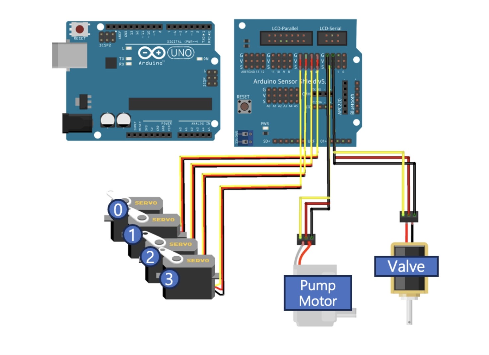

---
title:
  ko: '[Omok/02] 로봇팔 회로 제작 • 제어 코드 작성'
  en: '[Omok/02] 로봇팔 회로 제작 • 제어 코드 작성'
tags:
- Omok
pages: papers
style: fill
color: dark
img: ../assets/images/Omok/Robot/circuit.png
description:
  ko: 로봇팔을
    제어할 때 필요한 회로를 제작했고 제어에 필요한 통신 코드를 작성했다.
  en: Built the robotic arm needed to play Gomoku and write control code.
---
<!-- 한국어 콘텐츠 -->

  

## 회로 구성 
  

모터 제어를 위해 아두이노 쉴드 v5.0를 이용했다. 

## 4DOF 로봇팔 제어용 python 코드
오목을 플레이하는 인공지능의 행동을 현실에 올려두는 것이 목표이기 때문에 파이썬과의 시리얼 통신 기능을 구현했다.  

제어 py 파일에서는 항상  5가지 신호를 아두이노에게 전송한다. 4개의 각도 신호는 로봇팔의 4DOF를 제어하고, vacuum on/off는 흡착 기능을 켤지 끌지 신호를 준다.   

제어용 .py 파일
```py
def send_to_robot(self, angles_lst:list):
        if not isinstance(angles_lst, list):
            raise ValueError("Error: angles must be a list.")
        
        if len(angles_lst) != 5:
            raise ValueError("Error: list must have 5 elements (waist, shoulder, elbow, wrist, vacuum_on).")
        # 10 30 30 40 0 형태로 전송
        data_str = ' '.join(f"{int(angle)}" for angle in angles_lst)  
        self.serial.write((data_str + '\r\n').encode())  
        
        time.sleep(2)  # 데이터 전송 안정화
```


.ino 파일
```cpp
#include <Servo.h>

Servo air_pump;
Servo solenoid_valve;

Servo waist;
Servo shoulder;
Servo elbow;
Servo wrist;

int waist_angle = 10;
int shoulder_angle = 104;
int elbow_angle = 48;
int wrist_angle = 15;

void setup() {
    Serial.begin(115200);
    
    // suction servo
    solenoid_valve.attach(2);
    air_pump.attach(3);

    // robot arm servo
    waist.attach(4);
    shoulder.attach(5);
    elbow.attach(6);
    wrist.attach(7);

    initializeSystem();
}

void loop() {
    if (Serial.available()) {
        Serial.flush();  // 이전 버퍼에 남아 있는 데이터 삭제

        String data = Serial.readStringUntil('\n');  
        data.trim();  // 개행 문자 제거

        int absolute_angles[5];
        int index = 0;

        char buffer[50];  
        data.toCharArray(buffer, 50);  // String → char 배열 변환

        char *ptr = strtok(buffer, " "); 
        while (ptr != NULL && index < 5) {
            absolute_angles[index++] = atoi(ptr);  
            ptr = strtok(NULL, " ");
        }

        // 데이터 확인용 출력
        Serial.println("ACK");  // Python이 기다릴 수 있도록 응답 추가

        // 모터 제어
        moveToPosition(absolute_angles);
    }
}

void initializeSystem() {
    // vacuum
    air_pump.write(0);
    solenoid_valve.write(180);
    
    // robot arm 초기화
    waist.write(waist_angle);
    shoulder.write(shoulder_angle);
    elbow.write(elbow_angle);
    wrist.write(wrist_angle);
    delay(1000);

    Serial.println("System Initialized");
}

// vacuum ftn 
void activateSuction() {
    air_pump.write(180); // Air pump on
    solenoid_valve.write(0);   // Solenoid valve closed (vacuum created)
    delay(3000);
}

void releaseSuction() {
    solenoid_valve.write(180); // Solenoid valve open (air escapes, vacuum released)
    delay(1000);
}

void turnOffPump() {
    air_pump.write(0); // Air pump off
    delay(2000);
}

void convertLongToInt(long longArray[], int intArray[], int size) {
    for (int i = 0; i < size; i++) {
        intArray[i] = (int) longArray[i]; 
    }
}

void moveToPosition(int position[5]) {
    int step_delay = 20; // 움직임 속도 조절 (ms)

    // 현재 서보 모터 위치 가져오기
    int current_waist = waist.read();
    int current_shoulder = shoulder.read();
    int current_elbow = elbow.read();
    int current_wrist = wrist.read();

    // 목표 각도까지 부드럽게 이동
    for (int i = 0; i <= 100; i += 5) {  // 5% 단위로 점진적으로 이동
        waist.write(map(i, 0, 100, current_waist, position[0]));
        shoulder.write(map(i, 0, 100, current_shoulder, position[1]));
        elbow.write(map(i, 0, 100, current_elbow, position[2]));
        wrist.write(map(i, 0, 100, current_wrist, position[3]));

        delay(step_delay); // 움직임 속도 조절
    }

    // 최종 위치 설정 (혹시 오차가 있을 경우 보정)
    waist.write(position[0]);
    shoulder.write(position[1]);
    elbow.write(position[2]);
    wrist.write(position[3]);

    delay(500); // 모터가 안정화될 시간 부여

    // Vacuum (흡착 기능) 제어
    if (position[4] == 1) {
        activateSuction();
    } else {
        releaseSuction();
        turnOffPump();
    }
}
```




<!-- 영어 콘텐츠 -->


To be continue...



<div id="content-ko" class="lang-content" data-lang="ko">
  {{ ko_content | markdownify }}
</div>

<div id="content-en" class="lang-content" data-lang="en" style="display: none;">
  {{ en_content | markdownify }}
</div>
