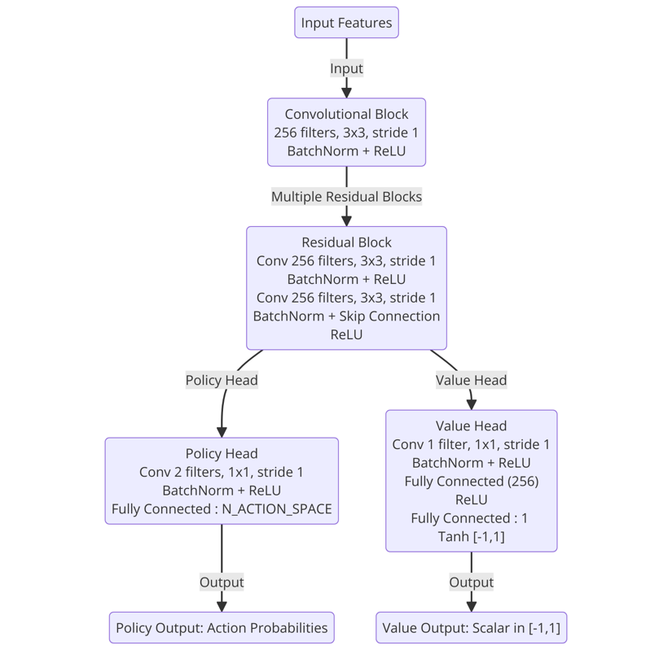
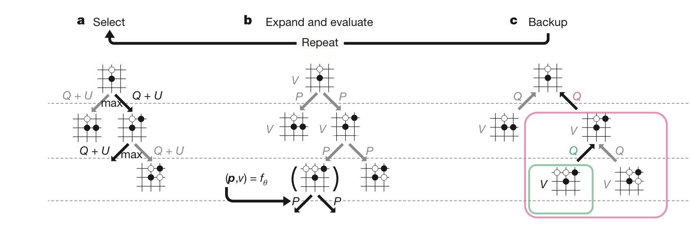
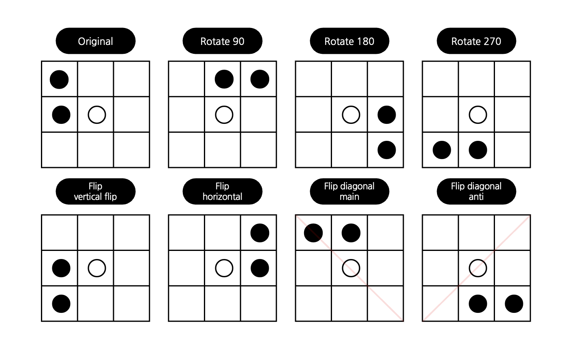
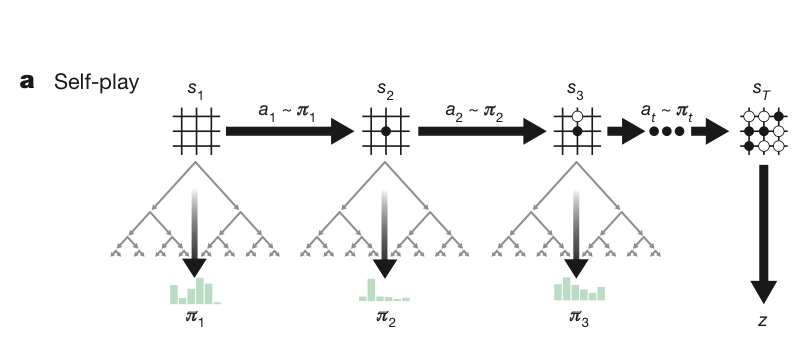

<!-- 한국어 콘텐츠 -->

  
## 알파제로 ( Alpha Zero )

**👇 원문 바로가기**  

> [**Mastering the game of Go without human knowledge (2017)**](https://www.davidsilver.uk/wp-content/uploads/2020/03/unformatted_final_mastering_go.pdf)
> 

### 의의

알파제로는 **완전한 비지도 학습**이란 점에서 의의가 있다. 지도 학습 방법론은 라벨링된 데이터를 학습하며, 일반적으로 다량의 데이터를 필요로 한다. 이런 지도 학습의 특징은 데이터를 구하기 어렵거나, 다량의 데이터를 구하는 것이 불가능한 분야에서 인공 신경망 적용의 문턱값을 높인다. 그에 반해 비지도 학습은 스스로 경험을 통해 데이터를 생성하고, 규칙을 학습하기 때문에 지도 학습이 갖고 있는 데이터 확보의 문제를 해결한다. 알파제로는 이전 모델인 알파고와는 달리, 바둑에서 인간의 라벨링된 데이터 없이 유의미한 학습에 성공한 최초의 모델이다. 

뿐만 아니라, 알파제로는 신경망에 입력되는 상태(input feature)를 백돌과 흑돌만을 활용하여 표현을 단순화했다. 또한, 기존에 분리되어 있던 정책 신경망과 가치 신경망을 단일 신경망으로 통합하였으며, 탐색 과정에서 롤아웃을 인공 신경망으로 대체해 연산량을 획기적으로 절감했다는 점에서 중요한 의미를 가진다. 

### 알파제로의 기본 골격
알파제로는 MCTS를 기본 알고리즘으로 사용하되, MCTS의 연산량 문제를 인공 신경망으로 대체한다. MCTS (Monte Carlo Tree Search ; 몬테카를로 트리 탐색)는 확률적 시뮬레이션인 몬테카를로와 트리 탐색을 합친 것으로, 시뮬레이션을 통해 턴제 게임에서 현재 내 상태의 최적의 수를 찾는 알고리즘이다. MCTS는 이론적으로 시뮬레이션 수를 늘릴수록 더 정확한 값을 얻을 수 있지만, 하나의 가치를 얻기 위해서 게임 종단까지 탐색(rollout)을 해야해 과도한 연산량을 수반한다는 단점이 있었다. 알파제로는 이 rollout 과정을 인공 신경망으로 대체해 연산량을 줄이고 학습의 효율성을 높였다. 

알파제로는 **자가대국(self-play)**을 통해 게임 데이터를 축적하고, 쌓인 데이터를 바탕으로 **신경망을 학습**시키는 사이클로 구성된다. 자가대국은 하나의 에이전트가 두 플레이어의 역할을 모두 수행하며 각 플레이어에게 있어 최선의 선택을 하는 방법론이다. 알파제로는 자가대국을 통해 데이터를 생성하고, 이를 학습하는 과정을 반복한다.  또한 학습 사이에 최고 성능 모델을 찾기 위한 **평가**를 진행한다.   

| 알파제로 구조 |
| --- |
| 1. 자가대국 (self-play) |
| 2. 학습 (train) |
| 3. 특정 시점마다 평가 (eval) |

&nbsp;
### 인공 신경망 (nn)

알파제로의 인공 신경망은 듀얼 신경망으로, 현재 state를 입력값으로 받아 현재 state의 정책과 가치를 출력한다. 

$$( \boldsymbol{p},  v ) = f_{\theta} (s)$$  

- $\boldsymbol{p}$ : 현재 상태에서 모든 행동에 대한 정책  $\{ p(s, a) \mid a \in A \}$
    - $A$ = { total actions + pass }
- $v$ : 현재 상태에서 가치 기댓값 $\{ v \in [-1, 1] \}$
- $\theta$ : 신경망의 파라미터
- $f$ : 인공 신경망 함수
- $s$ : 현재 상태

<h5>목표 값</h5>
알파제로에서 정책 생성 담당은 MCTS며, 인공신경망은 롤아웃을 대체해 MCTS의 연산량을 줄이고 효과적인 정책 생성을 위한 보조수단이다. 따라서 신경망은 롤아웃 근사를 위한 가치 예측과 정책 예측을 목표로 한다. 즉, 정책 $p$는 MCTS가 만들어내는 정책 $\pi$을, 가치 $v$는 현 상태의 결과를 나타내는 $z$를 목표값으로 학습한다.   

→ nn output : target = ( $\boldsymbol{p}_t,  v_t$  ) : ( $\pi_t, z_t$ ) 

<h5>손실 함수</h5>
손실 함수는 $p$의 경우 $\pi$ 사이의 유사도를 높이는 크로스 엔트로피를, $v$의 경우 $z$ 사이의 오차를 줄이는 mse loss를 이용해 학습한다. 

$$loss = ( z- v )^2 - \pi^Tlogp + c||\theta||^2$$

- $c$ : L2 정규화 파라미터로 과적합 방지에 이용한다.

<h5>신경망</h5>

ResNet을 이용해 깊은 CNN을 이용한다.   

&nbsp;
### MCTS

MCTS는 시뮬레이션을 통해 현재 상태에서 최적의 정책을 찾는다. 선택 - 확장 및 평가 - 역전파 과정을 수행하는 **playout**을 반복해 얻어진 자식 노드의 방문 빈도로 정책을 만든다. 

<h5>노드 구성</h5>

노드 (s,a)는 **사전 확률 (p), 총 방문 횟수 (n), 행동 가치 (Q), 하위 노드 집단의 가치 합(w)** 속성을 가진다. 이때 사전 확률은 노드가 확장될 때 주어지는 값이며, 나머지 세 속성은 방문과 역전파에 따라 가변적이다. 

---
### > Playout
<h5>playout 1. 선택 (Select)</h5>

자식 노드 중, 가장 큰 $Q(s_t,a) + U(s_t,a)$ 값을 갖는 행동을 선택한다. 

Q 값은  $\frac{w}{n}$으로 현재 노드의 가치며, PUCT 알고리즘으로 구하는 U 값은 탐색이다.  

$$
U(s_t,a) = C_{PUCT} * P(s,a) * \frac{\sqrt{\Sigma_bN(s,b)}}{1 + N(s,a)}$$  

- $C_{PUCT}$ : 탐험의 정도를 지정하는 상수

이 알고리즘은 초반에는 높은 사전 확률을 지니지만 방문 빈도가 낮았던 노드를 우선으로 탐색하며, 후반에는 높은 행동 가치를 가진 노드를 탐색해 탐험을 조절한다.  

<h5>playout 2. 확장 및 평가 ( Expand • Evaluation )</h5> 

종단 노드가 아닌데 자식 노드가 없는 leaf node 경우에는 노드를 확장한다. 노드를 확장할 때는 신경망의 정책을 이용해 자식 노드에 사전 확률을 부여한다. 이때 자식 노드의 속성은 주어진 사전 확률을 제외한 나머지 모든 값이 0으로 초기화되어 있다. (N.p = prior_p, N.n = 0, N.q = 0, N.w = 0 )

일반적인 MCTS와 달리, 알파제로는 확장된 현재 노드의 가치를 얻기 위해 rollout를 진행하지 않는다. 대신 인공 신경망의 가치로 rollout의 기대효과를 대체한다. 

바둑과 같은 보드 게임은 같은 판을 8가지 상황으로 바라볼 수 있다. 원본, 90도 회전, 180도 회전, 270도 회전, 상하반전, 좌우반전, 대각반전, 반대각반전을 해도 사실상 동일한 상태이기 때문이다. 알파제로는 확장 및 평가 시기에 8개의 상태 중 하나를 랜덤으로 사용하는 방식으로 보드게임의 특성을 반영한다. 

<h5>playout 3. 백업 ( BackUP )</h5>

현재 노드 하위 트리의 누적 합을 뜻하는 w에 하위 노드의 가치를 누적하고, 그 값을 바탕으로 행동 가치 Q를 계산한다. 

- $w = w +  v$
- $Q = \frac{w}{n}$

---

플레이아웃은 위 세 가지 과정으로 이루어지며, 자식 노드가 없는 리프 노드나 루트 노드에 도달하면 한 번의 플레이아웃이 완료된 것으로 간주된다. 따라서 플레이아웃은 종단 상태에 도달했을 때뿐만 아니라, 새로운 노드를 확장하는 상황에서도 실행이 종료된 것으로 본다.

<h5>정책 생성</h5>  

플레이 아웃을 수 차례 거치면 현재 상태 노드에 대한 자식 노드의 n이 축적된다. 모인 방문 빈도 n은 볼츠만 분포를 이용해 정책으로 만들어진다. 볼츠만 분포는 $\tau$를 파라미터로 갖는 확률 분포로, 이 상황에서는 아래와 같이 나타낼 수 있다. 

$$\frac{N(s,a)^{\frac{1}{\tau}}}{\Sigma_bN(s,b)^{\frac{1}{\tau}}}$$

온도  $\tau$는 탐험의 정도를 담당하는 파라미터다. 0에 가까워질수록 큰 빈도값에 쏠리는 원핫인코딩 형태가 되고, 커질수록 균등 분포를 갖게 된다. 알파제로는 $\tau$를 상황에 따라 0에 근접한 수와 1을 학습 파라미터로 사용한다. 
&nbsp;
### self play (자가 대국)

자가 대국은 하나의 고정된 신경망으로 실행되며, 시퀀스는 아래와 같다. 

1. 매 행동 선택마다 MCTS를 이용해 정책 $\pi_t$을 구한다.  ;  $\pi_t = \alpha_{\theta_{i-1}} (s_t)$ 
2. 종단 상태에 도달하거나, 최대 스텝 수에 도달하면 최종 리워드를 준다. 
이때 리워드는 승리 시 1, 패배 시 -1이다.  ; $r_T \in \{ -1, 1 \}$
3. 대국 종료 이후에 (2상황) 플레이어 역할에 맞게 z값을 역산한다. 
종단 상황의 플레이어와 동일한 역할이면 동일한 보상을, 아니면 -보상을 준다. 
4. 자가 대국이 끝날 때마다 자가 대국에서 만들어진 데이터 `( state, policy, z )`를 이용해 신경망 학습을 진행한다. 

알파제로는 $\tau$를 이용해 자가 대국 상황에서 탐험 정도를 조절한다. 19*19 보드 기준으로 30 수까지는 $\tau$를 1로 유지하고, 이후에는 0에 근접한 수로 $\tau$ 값을 죽여 원핫인코딩 형식의 정책을 이용한다. 하지만 이렇게 원핫인코딩 형식의 정책을 셀프플레이에서 사용하는 것은 탐험의 다양성을 저해해 학습을 어렵게 만든다. 이 문제를 해결하기 위해 Dirichlet 분포를 따르는 노이즈를 정책에 추가했다. 

$$
P(s, a) = (1 - \epsilon) p_a + \epsilon \eta_a, \quad \eta_a \sim \text{Dir}(0.03), \quad \epsilon = 0.25
$$

또한 신경망의 가치를 기준으로 임계값 $v$보다 낮은 $v$값을 가지면 게임을 중단시키는 조기 기권을 구현해 컴퓨팅 자원의 낭비를 방지한다. 이 값은 위양성(기권을 하지 않았으면 이겼을 게임) 비율이 5%가 되지 않도록 하는 선을 유지하며,조기 기권하지 않는 10%의 자가 대국을 이용해 임계값을 계산한다. 
&nbsp;
### state

알파제로의 state는 history를 쌓은 형태다. ( *BOARD_SIZE, 17 )형태로 17층 중 16층은 각각 현재 플레이어의 돌 위치($X_t$)와 적의 돌 위치($Y_t$)를 표현한다. 나머지 한 층은 선수인지 후수인지를 알려주는 층으로, 선수인 검은 돌의 차례면 1로 채워진 층을 아니면 0으로 채워진 층($C$)을 쌓는다. 17개의 층은 [ $X_t$, $Y_t$, $X_{t-1}$, $Y_{t-1}$, … , $C$ ]로 가장 최근부터 시간 순으로 차례대로 쌓여있다. 

### 평가 
평가는 최고 성능 신경망과 현재 학습된 신경망끼리 대국하는 방식으로 진행된다. 오목은 선을 잡는 것이 유리하기에, 선공 후공에 영향을 받지 않도록 번갈아가며 게임을 진행한다. 평가는 학습과 달리 순수한 신경망의 성능을 테스트하는 것이 목적이기 때문에 탐험 온도를 0으로 설정하며, 노이즈 또한 제거한다. 만약 최신 모델의 승률이 55%를 넘기면 최고 성능 모델을 현재 모델로 갱신한다.

### 탐험요소정리  
알파제로의 탐험은 **PUCT 알고리즘, 볼츠만 분포의 온도 파라미터, 그리고 노이즈**를 통해 조절된다. 먼저, MCTS 노드 확장에 사용되는 PUCT 알고리즘의 탐험 상수  C는 탐색 방식에 직접적인 영향을 미친다. C 값이 크면 다양한 노드를 탐색하는 경향이 강해지고, 값이 작으면 자주 방문한 노드를 우선적으로 선택하게 된다. 또한, 볼츠만 분포를 기반으로 한 정책 결정에서는 온도 파라미터를 조정하여 탐험의 정도를 조절한다. 학습 초반에는 온도를 1로 설정해 충분한 탐험이 이루어지도록 하며, 일정한 임계 시점 이후에는 온도를 0에 가까운 작은 값으로 낮춰 결정론적인 선택을 강화한다. 그러나 온도를 지나치게 낮추면 정책이 원-핫 인코딩 형태로 수렴하여 이후 학습 과정에 부정적인 영향을 미칠 수 있다. 임계 시점 이후 탐험 부족 문제를 해결하기 위해 Dirichlet 분포를 따르는 노이즈를 정책에 추가하여 추가적인 탐색을 유지한다. 이러한 방식으로 알파제로는 탐색과 활용 사이의 균형을 조절하며 최적의 학습을 수행한다. 

### 코드 
진행한 [오목 프로젝트](https://github.com/Tonnonssi/AiGO/tree/2758e97fd5d04f28a89a5c496d3bc2fe6eaa7964/Omok)에서 사용한 알파제로 골격이다. 


<!-- 영어 콘텐츠 -->


To be continue...



  {{ ko_content | markdownify }}

  {{ en_content | markdownify }}

