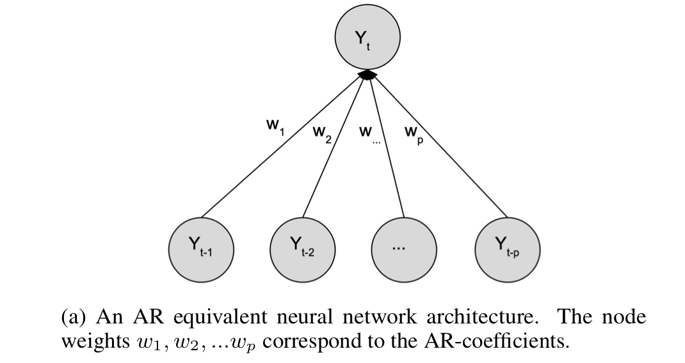
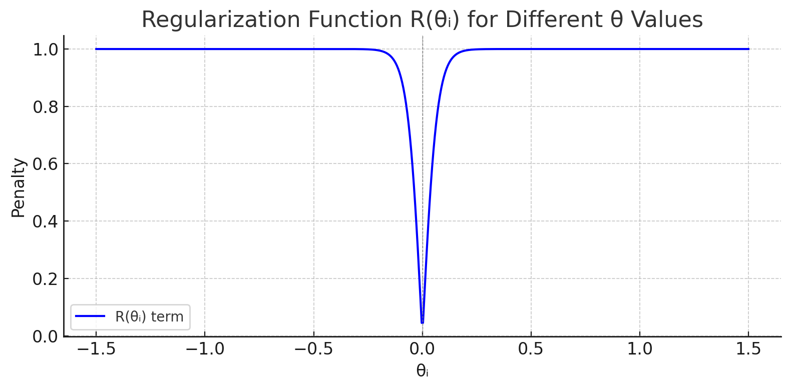
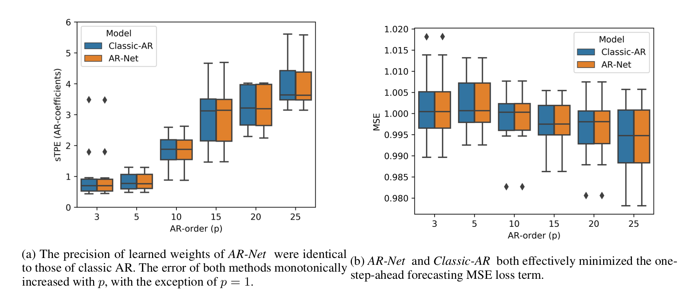
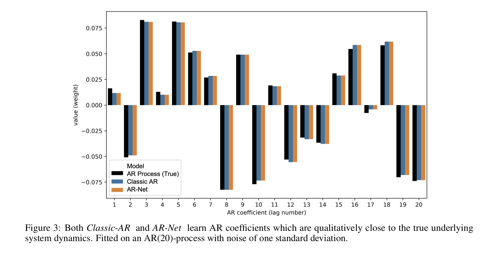
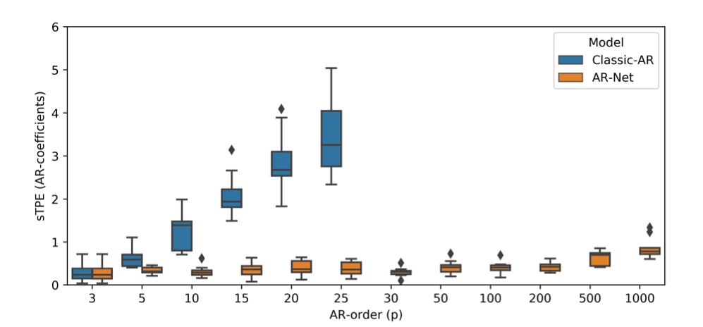
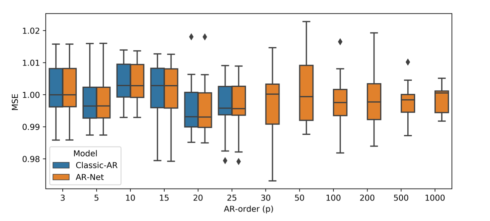
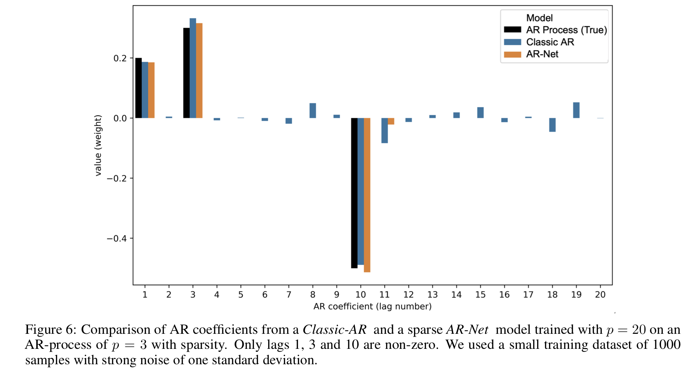
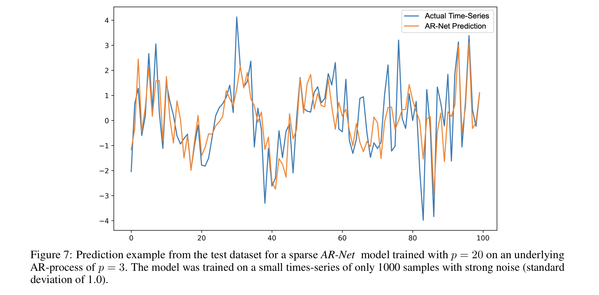
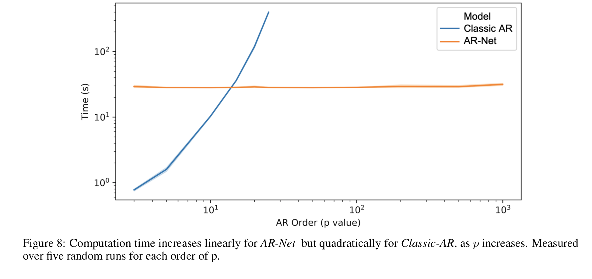

<!-- 한국어 콘텐츠 -->

## AR-Net

**👇 원문 바로가기**  

> [**AR-Net: A SIMPLE AUTO-REGRESSIVE NEURAL NETWORK
FOR TIME-SERIES (2019)**](https://arxiv.org/pdf/1911.12436)  
> 

## 의의 
AR-Net은 AR(Auto-Regression)을 간단한 신경망으로 근사해 장기 종속성이 존재하는 거대 데이터 처리를 가능하게 했다. 전통적 통계 모형은 모델을 해석하기에는 용이하지만, 장기 종속성을 띄는 빅데이터 처리에 적절하지 않았다. RNN, CNN과 같은 모델들은 고차의 복잡한 특징의 데이터 처리에 특화된 모델이기에 시계열 데이터와는 성향이 맞지 않았다. AR-Net은 단순한 전연결 신경망을 이용해 AR을 모델링해 '근사'라는 신경망의 장점과, '해석이 쉬운' AR의 장점을 한데 모았다. 이 신경망은 일반 AR 계산 과정보다 계산 복잡도가 낮아 긴 시간 지연에 대한 분석을 간편하게 실행하며, 정규화를 통해 자동으로 AR의 계수를 선택하게 한다.  

## Classic-AR Model 
시계열 데이터 처리의 핵심은 예측이다. 정확한 예측을 위해서는 과정에 영향을 주는 요인과 데이터의 자기상관을 분석해야 한다. AR은 근본 통계적 시계열 처리 모델로서, 시계열의 특성을 단순한 선형 식으로 모델링한다.  

$$
y_t = \phi_0+\phi_1 y_{t-1}+...+\phi_py_{y-p}+\epsilon_t
$$

$y_t$: 현재 시점의 값  

$y_{t-1},...y_{t-p}$: 과거 시점의 값(Lags)  

$\phi_{i}$: 모델의 계수 ($i=0,...,p)$  

$\epsilon_t$: 예측 오차  

$p$ : 현재 시점의 값과 연관이 있는 시차  

AR 모델은 정확한 차수 ( $p$ )를 안다는 강한 가정을 바탕으로 하며, 이 가정이 깨졌을 때는 제대로 작동하지 않는다. 계수 추정에는 일반적으로 최소 제곱법(least square)이 이용되며, $O(p^2 * N)$ 시간 복잡도를 가져 고차 $p$로 갈수록 계산량이 급격히 증가해 현실적으로 긴 과거를 고려하기 어려워진다. 

## AR-Net 
### 인공 신경망의 장점
> 신경망의 비선형성은 복잡한 임의의 함수를 근사하는데 효과적이며 비모수적 모델이기에 데이터와 관련된 강한 가정이 필요하지 않다. 이러한 인공 신경망의 특성은 AR을 효과적으로 근사할 수 있게 만들며, 낮은 시간 복잡도를 가져 큰 시간 지연 상황에서도 모델링을 가능하게 한다.  

---
AR-Net은 Classic-AR Model의 계수를 학습 파라미터($w_i$)로 설정해 AR을 근사한다. 
  

### loss • optimizer 
mse loss와 SGD를 사용한다. mse 대신 Hinge-loss를 이용해도 되지만, 본 논문은 클래식 AR과 신경망으로 근사한 AR 사이의 차이를 비교하고자 mse를 사용한다. 

$$
\min_{\theta} L(y, \hat{y}, \theta) = \frac{1}{n} \sum_{i=1}^{n} (y_i - \hat{y}_{\theta})^2
$$

### 규제 : Sparse AR-Net
일반적인 AR 모델은 p를 알고 있어야지 명확한 모델링이 가능하다. 또한 일반 AR 모델은 시간 지연 p가 증가함에 따라 계산량이 기하급수적으로 증가해 큰 시간 지연에 대한 데이터를 처리할 수 없다. 이런 제약을 완화하기 위해서 본 논문은 sparse한 AR 계수를 찾고자 한다. sparse(희소하다)라는 것은 대부분이 0으로 이루어졌다는 것이다. 희소 AR 계수를 통해 큰 시차가 있는 데이터 사이의 관계를 모델링할 수 있고, AR의 계수가 반드시 연속된 시차로 구성되어 있어야 한다는 AR 모델의 가정을 제거한다.   

희소 AR 계수 모델링을 위해 본 논문은 **규제**를 이용한다.   

$$

\min_{\theta} L(y, \hat{y}, \theta) + \lambda(s) \cdot R(\theta) \\

\lambda(s) = c_{\lambda} \cdot \left( s^{-1} - 1 \right) \\
$$

$$
R(\theta) = \frac{1}{p} \sum_{i=1}^{p} \frac{2}{1 + \exp\left(-c_1 \cdot \left| \theta_i \right|^{\frac{1}{c_2}}\right)} - 1
$$

- $s = \frac{\hat{p}_{data}}{p_{model}}$ : AR 계수의 희소성의 기댓값 • 원하는 희소성 정도로 연구자가 설정하는 하이퍼 파라미터다. 

- $c_{\lambda} \approx \frac{\sqrt{\hat{L}}}{100}$ : 규제의 세기로, 추정된 잔차에 비례한다.   

- $c_1$ : 0 근처의 값을 강하게 억제하는 파라미터다.    

- $c_2$ : 0이 아닌 큰 값에게 약한 규제를 가하는 파라미터다.  

이 테스크의 경우 가장 대중적인 가중치 규제 방식인 L1, L2 규제가 효과적이지 않았다. L1, L2 규제는 큰 가중치를 줄이며 과적합을 방지하는데, 현재 상황에는 0에 가까운 가중치를 확실하게 줄이되 값이 있는 가중치를 수정하지 않는 규제가 필요하기 때문이다. 이를 구현하기 위해, 본 논문에서는 0 근처에서 큰 기울기를 가지며 1 근처에서는 급격하게 감소하는 형태의 규제 함수를 사용했다. 이 방식을 통해 0에 가까운 가중치는 확실하게 0으로 수렴시키고, 1에 가까운 가중치는 거의 변하지 않게 만든다.  

   
(c1과 c2가 각각 30, 1일 때 손실 함수 그래프)

---

$$
R_{alt}(\theta) = \frac{1}{p} \sum_{i=1}^{p} \sqrt{|\theta_i|}
$$
  
이 규제 함수는 정리할 때는 직접 사용하지는 않았지만 좋은 성능을 보였다고 소개한 함수다. 

---

## 평가 
### 데이터 생성 
이 연구의 목적은 AR-Net이 AR을 얼마나 잘 근사하는 지를 확인하는 것이다. 이를 명확하게 분석하기 위해서는 AR의 계수를 알고 있어야 한다. 따라서 본 연구는 계수를 정량적으로 비교하기 위해 기저 AR의 계수를 랜덤으로 지정한 뒤 ~N(0,1)을 따르는 잡음을 추가해 합성 데이터를 만들었다. 이때 완성된 AR 계수가 [-1,1] 사이에 존재하도록 추가적인 스케일링을 진행해 안정성을 보장한다. sparse한 상황을 모델링할 때는 불안정성을 줄이기 위해 [0.2, 0.3, -0.5]로 계수를 고정해 실험을 진행했다.  

본 연구는 총 125,000의 데이터 셋 (학습용 : 100,000, 테스트용 : 25,000)으로 학습을 진행했고, 적은 양의 데이터에서도 모델이 잘 작동하는지 알기 위해서 (학습용 : 1000, 테스트용 : 1000) 검정 또한 추가적으로 진행했다.  

### 시각화 및 지표 
본 연구는 AR-Net이 AR의 계수를 얼마나 잘 근사하는지를 평가하고, 예측 성능이 어느 정도인지 평가하고자 한다. 모델 계수 비교를 위해 sTPE(symmetrical Total Percentage Error)를, 예측 성능을 측정하기 위해 MSE loss를 이용했다.  

$$
sTPE = 100 \cdot \frac{\sum_{i=1}^{p} |\hat{w}_i - w_i|}{\sum_{i=1}^{p} |\hat{w}_i| + |w_i|}
$$

---

<h5>AR-Net이 AR을 잘 근사하는가?</h5>

[1]  

  

AR-Net이 AR의 계수를 잘 근사했으며, loss를 잘 줄이는 방향으로 학습되었음을 알 수 있다.  

[2]  

  

이 그래프를 통해 AR-Net이 AR과 거의 동일한 계수로 시계열 상황을 모델링했음을 알 수 있다.  

<h5>장기종속성 데이터에서 AR 모델 적용</h5>

[1]   

  

[2]   

  

[1]의 AR 모델은 p가 증가함에 따라 오차 범위가 커지는 것에 반해, AR-Net은 지연 시간의 크기와 무관하게 일정한 오차범위를 갖는다. [2] 그래프에서는 p=25까지 거의 동일한 성능을 보이지만, [1]의 결과를 미루어 비춰볼 때 AR-Net이 클래식 모델보다 더 좋은 모델링을 진행한다 볼 수 있다.  

적은 수의 AR 계수만 활성화하고 나머지를 0에 가깝게 만들어 모델이 핵심적인 계수만을 가지게 하는 희소도($s$)의 적정값을 찾고자 했다. 본 연구는 0.003의 희소도까지 AR-Net이 제대로 작동함을 확인했다. 
    

[3]   

일반적으로 적은 데이터에서는 딥러닝 방법론보다는 통계적 방법론이 더 높은 성능을 보이지만, AR-Net은 적은 데이터에서도 제대로 동작하며 클래식 AR보다 노이즈에 강한 모습을 보였다.  

p=3인 합성 데이터를 p=20인 모델로 학습해 희소 계수를 잡아낼 수 있는지 테스트했다. AR-Net이 정확한 계수만을 잡아내고 나머지 계수를 sparse하게 잡아냄에 비해, AR은 노이즈에 영향을 받은 모습을 보인다. 이런 경향은 sTPE에서도 포착됐다. 예측 성능 지표인 MSE는 유사했지만, sTPE는 AR-Net이 3.2, AR이 18.3으로 AR의 오차가 AR-Net에 비해 약 6배 가량 더 높았다. 

[4]   

   

[3]와 동일한 상황에서 예측 정도를 시각화했다.   

## 시간 복잡도 

| .| Classic AR | AR-Net | 
| - | - | - | 
| 시간 복잡도 | $O(p^2 * N)$ | $O(E * N / B * \theta)$ | 

-	 $p$  : AR 프로세스의 차수(order)  
-	 $N$  : 학습 데이터 크기(training size)  
-	 $E$  : epoch 수(number of training epochs)  
-	 $B$  : batch 크기(batch size)  
-	 $\theta$  : 모델의 파라미터 수 (이 실험에서는  $\theta = p$ )  

classic AR은 p에 비해 이차적으로 증가하기 때문에 장기적인 시차를 고려할 수 없다. 하지만 AR-Net은 파라미터 수에 선형적인 시간 복잡도를 가지기에 장기 시계열 데이터 분석에 사용할 수 있다.  

   

## 코드 

[바로가기](https://github.com/Tonnonssi/25-1-StockPredictions/blob/04c020eab745e842f8ad82b33ae997c6b317f784/net/testing/ARNet.ipynb)



<!-- 영어 콘텐츠 -->


To be continue...



  {{ ko_content | markdownify }}

  {{ en_content | markdownify }}

