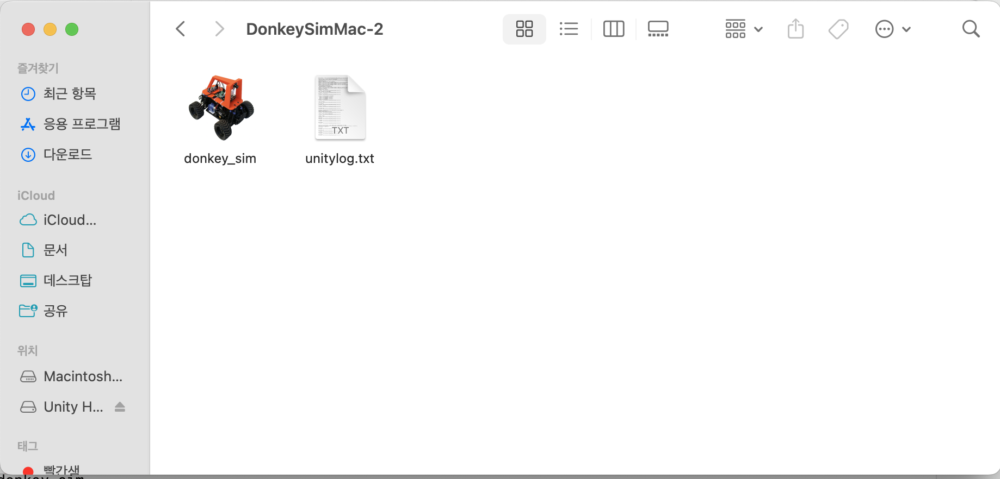
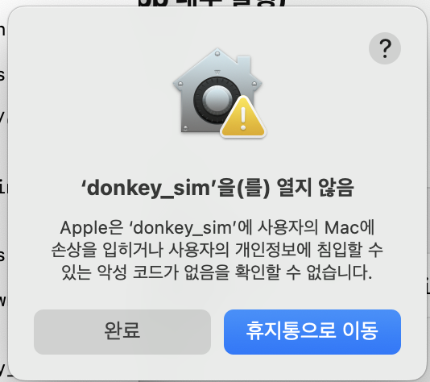

---
title:
  ko: '[DonkeyGym/01] mac m1 환경 설정'
  en: '[DonkeyGym/01] mac m1 환경 설정'
tags:
- RL
pages: papers
style: border
color: secondary
img: ../assets/images/DonkeyGym/Basic/image.png
description:
  ko: 자율주행 입문용으로 유용한 DonkeyGym을 mac m1 환경에 세팅했다.
  en: Set up DonkeyGym, a useful simulator for getting started with autonomous driving,
    on an M1 Mac.
---

<!-- 한국어 콘텐츠 -->

  
## Donkey Gym이란 
Donkey Gym은 오픈소스 자율주행 프로젝트인 Donkey Car를 위한 강화학습 시뮬레이터로 개발되었다. **Unity 엔진**을 기반으로 작동하며, Python에서 널리 사용되는 **OpenAI Gym** 스타일의 인터페이스를 사용해 강화학습 알고리즘과 쉽게 연동할 수 있다.

### 환경 설정 단계  
1. 유니티 설치 -> [바로가기](https://unity.com/kr)
2. 시뮬레이터 설치 -> [바로가기](https://github.com/tawnkramer/gym-donkeycar/releases)
3. 파이썬으로 시뮬레이터 테스트  

---
#### 2. 시뮬레이터 설치 
`바로가기`에 링크되어 있는 환경을 다운로드 받으면 된다. 맥은 윈도우와 달리 다운받은 시뮬레이터를 .app 내부로 실행할 수 있도록 추가 설정이 필요하다. 만약 이 과정을 생략하고 시뮬레이터를 클릭한다면, 열 수 없는 앱이라는 오류가 발생한다.  

.app 내부로 실행하기 위해서는 권한을 주어야 하고, 터미널에 아래 명령어를 입력해 설정할 수 있다.  
```
cd {경로에 맞게 수정}/DonkeySimMac/donkey_sim.app/Contents/MacOS
chmod +x donkey_sim
```

  
위 이미지에서 보이는 donkey_sim 아이콘의 경로를 현재 위치로 받는 것이며, (option + command + C)로 손쉽게 실행할 수 있다.  
- `unitylog`는 donkey_sim을 유니티로 실행한 이후에 생성되며, 다운로드받았을 때 존재하는 파일은 아니다.  

권한 설정이 완벽하게 되었으면 앱을 눌렀을 때 실행이 되어야 하는데, 아래와 같은 경고창이 뜨면서 앱이 열리지 않는다.  

  

이는 맥 운영 체제 내 보안 기능 때문으로, 아주 간단하게 해결 가능하다.  

1. '휴지통으로 이동'을 누르지 말고, '완료'를 누른다.  
2.  [시스템 설정] > [개인정보 및 보안]에서 아래로 내려가 경고창을 찾는다. ""donkey_sim"은(는) 차단되었습니다. 그래도 열 수 있습니다." 문구가 뜨며, 이때 '그대로 열기'를 클릭하면 보안 기능을 성공적으로 우회할 수 있다.  

#### 3. 파이썬으로 시뮬레이터 테스트  
깃허브에서 DonkeyGym을 다운받는다.  
```
pip install git+https://github.com/tawnkramer/gym-donkeycar
```

아래 코드를 실행하면 100step동안 속도 0.5로 굴러가는 동키카 시뮬레이션을 볼 수 있다.  

```py
import os
import gym
import gym_donkeycar
import numpy as np

# 올바른 실행 파일 경로 (macOS용)
PATH_TO_APP = "{이전경로}/DonkeySimMac/donkey_sim.app/Contents/MacOS"
exe_path = f"{PATH_TO_APP}/donkey_sim"
port = 9091

conf = {
    "exe_path": exe_path,
    "port": port
}

# 시뮬레이터 자동 실행 + 환경 생성
env = gym.make("donkey-generated-track-v0", conf=conf)

# 차량 간단히 움직여보기
obs = env.reset()
for t in range(100):
    action = np.array([0.0, 0.5])  # 조향 0, 속도 0.5
    obs, reward, done, info = env.step(action)
    if done:
        break

env.close()

```


### 레퍼런스 
[http://docs.donkeycar.com/guide/deep_learning/simulator/](http://docs.donkeycar.com/guide/deep_learning/simulator/)  




<!-- 영어 콘텐츠 -->


To be continue...



<div id="content-ko" class="lang-content" data-lang="ko">
  {{ ko_content | markdownify }}
</div>

<div id="content-en" class="lang-content" data-lang="en" style="display: none;">
  {{ en_content | markdownify }}
</div>