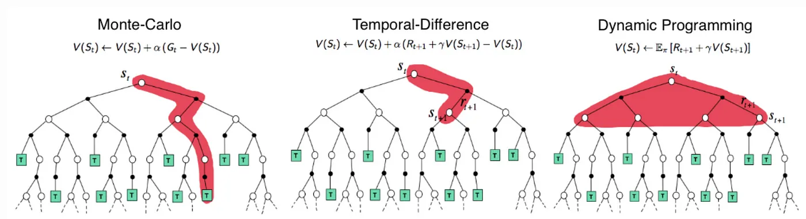
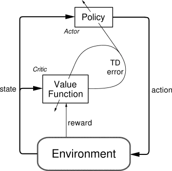
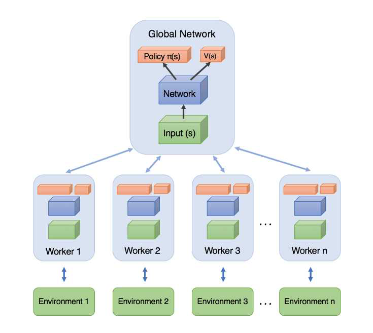
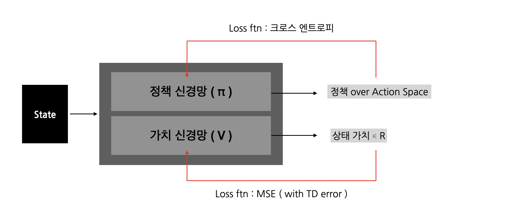

<!-- 한국어 콘텐츠 -->

## [BG] 정책 중심 RL, 가치 중심 RL 
강화학습 구현은 크게 **정책** 중점 방법론, **가치** 중점 방법론 두 개로 나뉜다.  

### 정책 중심 RL
먼저 정책 중점 방법론은 가치 함수를 명시적으로 근사하지 않고, 최적 정책을 직접적으로 근사한다. 정책 중점 방법론은 $\pi_\theta(a|s)$,  $\theta$ 로 조정가능한 정책 함수를 정의하고 그래디언트 조정을 통해 최적 정책 함수를 구한다. 이는 기대 누적 보상을 극대화하는 강화학습의 학습 목표를 직접적으로 최적화한다는 점에서 이론적으로 일관성이 있다는 장점이 있다. 하지만 각 상태-행동 쌍의 정확한 가치 정보를 사용하지 못하고, 시뮬레이션 기반 추정치를 사용하기 때문에 그래디언트의 분산이 커질 수 있으며, 학습 안정성을 저해할 수 있다. 

#### 예시 

$$\nabla_\theta J(\theta) = \mathbb{E}_{\pi_\theta} \left[ \nabla_\theta \log \pi_\theta(a|s) \cdot Q_{\pi_\theta}(s, a) \right]$$

- 폴리쉬 그래디언트의 정책 신경망 업데이트 식  

대표적인 정책 기반 RL인 Reinforce 알고리즘은 알 수 없는 $Q(s, a)$ 을 반환값인 $G_t$로 치환한다. 

### 가치 중심 RL 
가치 중심 강화학습 방법론은 정책을 명시적으로 파라미터화하지 않고, 상태-행동 가치 함수  $Q(s, a)$ 를 근사하여 간접적으로 최적 정책을 유도한다. 가치 함수가 잘 근사된다면, 에이전트는 각 상태에서 가장 높은 가치를 갖는 행동을 선택하는 정책  $\pi(s) = \arg\max_a Q(s, a)$ 을 따름으로써 최적의 행동 전략을 수행할 수 있다. 이러한 방법은 일반적으로 Temporal Difference(시간차) 학습을 사용하여 벨만 방정식을 근사하고, 반복적인 예측-업데이트 과정을 통해 수렴한다. 그러나 정책을 직접 최적화하지 않기 때문에 확률적 정책 표현이 어렵고, 적절한 탐험(exploration)이 외부 메커니즘(예: ε-greedy)에 의해 보장되어야 원활한 학습이 가능하다.

---
### 💡 Temporal Difference(시간차) 학습

  

시간차 학습(Temporal Difference Learning)은 model-free 환경에서 표본 경로를 이용해 가치 함수를 추정할 수 있는 Monte Carlo 방식의 장점과, 모든 에피소드가 종료되지 않아도 시간 단계별로 값을 업데이트할 수 있는 Dynamic Programming의 장점을 결합한 방법론이다. 이 방법은 벨만 기대 방정식을 기반으로 하며,

$$v_{\pi}(s) = \mathbb{E}_{\pi}[R_{t+1} + \gamma V_{\pi}(S_{t+1}) | S_t = s]$$

의 우변에 해당하는 값  $R_{t+1} + \gamma V_{\pi}(S_{t+1})$ 을 TD 타겟으로 삼아, 예측값과의 오차를 줄여가는 방식으로 학습을 진행한다.  

일반적으로 시간차 학습에서는 다음 상태에서의 예측값을 사용하여 현재 가치 추정을 업데이트하는데, 이때 1스텝 TD 타겟을 사용하는 방식을 TD(0) 라고 한다.
반면, 미래  n  스텝에 걸친 실제 보상 시퀀스를 이용해 업데이트하는 방식을 TD(n) 이라고 하며,
 $n \to \infty$ 인 경우는 에피소드 전체를 활용하는 Monte Carlo 방식, 즉 TD(1) 이 된다.

### Monte Carlo vs Bootstrap in RL 
부트스트랩은 다음 상태의 가치 추정치를 활용해 현재의 가치를 갱신하는 방식이다. 이는 학습 속도가 빠르고 데이터 운용 효율성이 높지만, 추정치에 의존해 편차가 심하다. 반면 몬테카를로 방식은 모든 에피소드가 종료된 이후 전체 반환값을 기반으로 학습한다. 이 방식은 편차는 적지만, 분산이 크다는 단점과 에피소드가 종료된 이후에만 업데이트가 가능하다는 단점이 있다.  

---

## Actor Critic
Actor-Critic 알고리즘은 정책 중심 방법과 가치 중심 방법의 장점을 결합한 접근으로, 직접적인 정책 최적화의 효율성과 Temporal Difference 기반 학습의 안정성을 동시에 추구한다. 이 구조는 정책을 근사하는 Actor와, 해당 정책의 성능을 TD 오차 기반으로 평가하여 피드백을 제공하는 Critic으로 구성된다. Actor는 정책 파라미터를 그래디언트 방식으로 업데이트하며, Critic은 TD 오차를 줄이기 위해 가치 함수를 학습한다. 따라서 Actor-Critic은 정책 그래디언트를 TD 기반으로 근사한 구조로 이해할 수 있다.

  

정책 그래디언트 기반의 액터 크리틱 알고리즘은 아래와 같이 정의된다.  
$$\nabla_\theta J(\theta) = \mathbb{E}_{\pi_\theta} \left[ \nabla_\theta \log \pi_\theta(a|s) \cdot Q_{w}(s, a) \right]$$

- $\theta$ : 정책 신경망의 파라미터  
- $w$ : 가치 근사 신경망의 파라미터  

그러나 위와 같은 방식은 샘플링 기반 추정에서 분산이 커져 학습의 불안정성을 초래할 수 있다. 이를 완화하기 위해 Actor-Critic에 어드벤티지 함수를 도입한 방법론이 **A2C : Advantage Actor-Critic**이다.  

### A2C : Advantage Actor-Critic

> Advantage 함수 

$$A(s, a) = Q_w(s, a) - V_v(s)$$

어드벤티지 함수는 상태 가치 함수  $V_v(s)$ 를 baseline으로 사용하여 Q-함수의 분산을 줄이는 것을 목적으로 한다. 상태 가치 함수는 각 행동이 아닌 상태 고유의 기대 가치를 근사하기 때문에 분산이 상대적으로 작다. 
따라서  A(s, a) 는 상태-행동 가치 함수에서 상태 가치 함수를 제함으로써, 각 행동이 상태에서 갖는 **상대적 우수성(advantage)**만을 강조하며 정책 그래디언트의 분산을 효과적으로 감소시킨다.  

실제로 Q-함수와 V-함수를 별도로 학습하지 않고, TD 오차를 이용하여 어드벤티지 함수를 근사할 수 있다. TD 오차는 다음과 같이 정의된다:

$$\delta_v = R_{t+1} + \gamma V_v(S_{t+1}) - V_v(S_t)$$

이 오차는 실제 보상과 상태 가치 함수의 예측 간 차이를 나타내며,  $A(s_t, a_t) \approx \delta_v$ 로 간주될 수 있다.
이를 활용한 정책 그래디언트는 다음과 같다:

$$\nabla_\theta J(\theta) = \mathbb{E}_{\pi_\theta} \left[ \nabla_\theta \log \pi_\theta(a|s) \cdot \delta_v \right]$$

결과적으로, 어드벤티지 함수는 상태에 대한 baseline인  $V(s)$ 를 활용하여 gradient의 기대값은 유지하면서 분산을 줄이는 역할을 수행한다.  

#### 장단점
A2C는 온폴리쉬 방법론으로 실시간으로 학습가능하다는 장점이 있지만, 학습에 이용되는 샘플의 상관도가 높다는 한계가 존재한다.  

### A3C :  Asynchronous Advantage Actor-Critic 
> 논문 바로가기 : [Asynchronous Methods for Deep Reinforcement Learning (2016)](https://arxiv.org/pdf/1602.01783)  

A3C는 여러 에이전트를 **비동기**적으로 작동시켜 A2C의 샘플 간의 상관도 문제를 해결한다.  

A3C는 여러 에이전트들이 분리된 환경에서 독립적으로 학습하며, 여기서 발생한 샘플을 모아 학습하는 글로벌 신경망으로 이루어져 있다.  

   

글로벌 신경망은 에이전트들이 만들어낸 에피소드를 일정 타임 스텝 동안 저장하고, 저장한 샘플을 이용해 업데이트를 진행한다. 각 에이전트의 신경망은 업데이트된 글로벌 신경망으로 업데이트된다. A3C는 이러한 사이클을 반복하며 온폴리쉬의 장점을 살려면서 샘플 간의 상관도를 낮춘다. 

### A2C 구현 
  

## 출처 
1. [강화학습에서의 bootstrapping은 무엇인가? (What is bootstrapping in RL?)](https://cumulu-s.tistory.com/7)  

2. [A (Long) Peek into Reinforcement Learning](https://lilianweng.github.io/lil-log/2018/02/19/a-long-peek-into-reinforcement-learning.html)  

3. [강화 학습 - A3C(Asynchronous Advantage Actor-Critic)](https://wnthqmffhrm.tistory.com/20)  

4. [The Actor-Critic Reinforcement Learning algorithm](https://medium.com/intro-to-artificial-intelligence/the-actor-critic-reinforcement-learning-algorithm-c8095a655c14)  

5. [The idea behind Actor-Critics and how A2C and A3C improve them](https://theaisummer.com/Actor_critics/)  



<!-- 영어 콘텐츠 -->


To be continue...



  {{ ko_content | markdownify }}

  {{ en_content | markdownify }}

