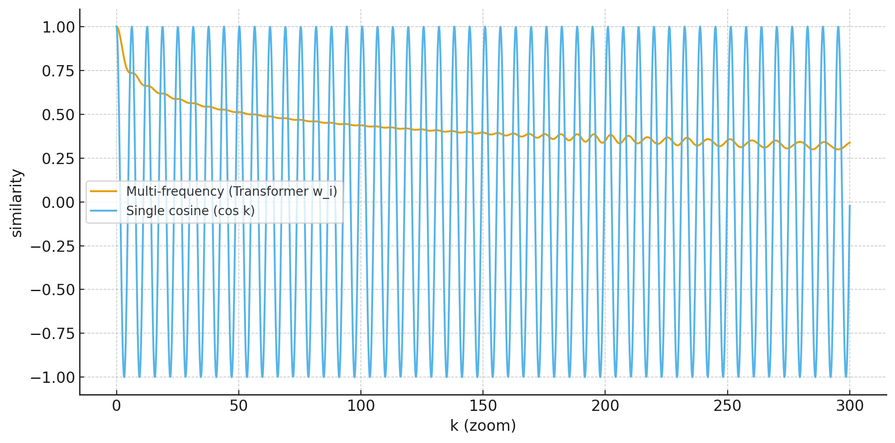

---
title:
  ko: '[DL/Timeseries] 트랜스포머'
  en: '[DL/Timeseries] Transformer'
tags:
- PaperReview
style: border
img: '../assets/images/transformer/structure.png'
description:
  ko: "'Attention Is All You Need' 논문을 리뷰하고 Attention, LayerNorm, Positional Encoding에 관한 세부사항을 보완한다. "
  en: "Review 'Attention Is All You Need 'and fill details of Attention, LayerNorm, Positional Encoding."
---

<!-- 한국어 콘텐츠 -->


> 논문 바로가기 : [Attention Is All You Need (2017)](https://arxiv.org/abs/1706.03762)




1. 들어가며
2. 전체 구조도
3. Attention
4. Positional Encoding
5. LayerNormalization




## 1. 들어가며 

트랜스포머 이전 시계열 데이터 처리에는 RNN, LSTM, GRU 와 같은 신경망이 널리 이용됐다. 



"Attention Is All You Need(2017)"에서 소개된 트랜스포머 모델은 기존에 주류로 사용되던 재귀 신경망 구조를 완전히 배제하고, **어텐션 메커니즘만으로 입력과 출력 간의 장거리 의존성을 포착하여 시계열 데이터를 효율적으로 처리**한다. 이 접근법은 병렬 처리가 가능하면서도 장기적인 문맥 정보를 더 정확히 반영한다.

## 2. 전체 구조도 



트랜스포머 모델은 인코더-디코더 구조로 이루어져 있다. 인코더와 디코더는 각각 공통 레이어를 층층이 쌓아 놓은 구조로, 레이어는 멀티 헤드 어텐션과 FFN로 구성되어 있다. 입력되는 데이터는 포지셔널 인코딩을 추가해 데이터의 순서 정보를 포함한다.  

- **Encoder**  

인코더는 총 6개의 레이어로 이루어져 있고, 각 레이어는 한 번의 멀티 헤드 셀프 어텐션, 한 번의 FFN으로 구성되어 있다. 두 보조 레이어는 공통적으로 잔차를 더하고, 레이어를 정규화하는 과정을 수행한다. 이를 정리하면 다음과 같은 정의가 성립한다. 

$$LayerNorm(x + Sublayer(x))$$  

- **Decoder**   

디코더는 인코더와 마찬가지로 총 6개의 레이어로 이루어져 있고, 각 레이어는 두 번의 멀티 헤드 어텐션과 FFN으로 구성되어 있다. 인코더와 달리, 디코더의 셀프 어텐션은 이후의 정보를 참고하지 못하도록 마스킹되어 있으며 인코더의 출력값과 디코더의 셀프 어텐션 값을 모델링하는 어텐션으로 나누어져 있다. 

- **FFN**

뒤에 설명할 어텐션, 포지셔널 인코딩에 비해 단순한 구조를 갖고 있기에 여기서 정의한다. ReLU를 활성화 함수로 갖는 두 층짜리 앝은 전연결 신경망이다.  

$$FFN(x) = ReLU(xW_1 + b_1)W_2 + b_2$$  

## 3. Attention 

어텐션 알고리즘은 입력 시퀀스 벡터 집합에서 중요한 부분에 더 큰 가중치를 주는 연산이다. 과거에 Seq2Seq 모델들은 context vector라는 고정된 벡터를 만들어 입력 벡터의 전체 요소를 하나에 몰았다. context vector는 고차원 입력을 저차원으로 압축하기 때문에 표현력이 제한적이었다. 또한 이 벡터는 추상적이어서, 모델의 작동 원리를 해석하기 어렵다는 한계가 있었다. 어텐션 알고리즘은 요소 사이의 관계를 집중적으로 모델링해 이런 문제를 극복했다. 

### 3-1 Attention 구성요소 

Attention 알고리즘은 **Query, Key, Value**를 학습한다. 

-	Query(Q): 현재 단어(또는 상태)에서 만들어지는 벡터로, 다른 단어와의 연관성을 탐색하는 기준이 된다.  
-	Key(K): 각 단어가 가진 고유한 특징(주소 역할)을 나타내며, Query가 어떤 단어를 참고해야 하는지 결정한다.  
-	Value(V): 실제 정보(내용)를 담고 있으며, Attention 가중치로 평균화되어 최종 출력으로 전달된다.  

Query를 기준으로 탐색하기 때문에, (Key와 Value)는 동일한 입력 데이터가 필요하다.  

- 🌟 **Query, Key, Value의 파라미터화**  
{% include elements/media-block.html
     image="../assets/images/transformer/vs1.png"
     alt="Query, Key, Value의 파라미터화"
     body="트랜스포머 이전의 Attention은 주로 LSTM 기반 Seq2Seq 모델에서 사용되었으며, 이때 Query, Key, Value는 인코더와 디코더의 은닉 상태를 **그대로** 활용하여 계산되었다. 반면 본 논문에서는 Query, Key, Value의 역할과 학습 목적을 보다 명확히 하기 위해, 각기 다른 가중치 행렬 $W^Q, W^K, W^V$를 통해 입력을 선형 변환하여 직접적으로 **파라미터화(projection)**하였다. Query와 Key에는 $d_{model}$ x $d_k$ 크기의 파라미터가, Value에는 $d_{model}$ x $d_v$ 크기의 파라미터가 사용되며, 일반적으로 $d_k, d_v$ << $d_{model}$의 관계가 성립해 학습의 안정성이 높아진다. "
     source="출처: https://wikidocs.net/31379" %}

- **Self-Attention**  
Self-Attention은 동일한 시퀀스 내에 있는 요소와 요소 사이 관계를 알고 싶을 때 사용한다. 이때 Q,K,V는 전부 동일한 데이터를 이용한다. 셀프 어텐션은 본 논문 이전에 소개된 개념이지만, 트랜스포머의 대중화 이후 주류에 자리잡았다.  

### 3-2 Scaled Dot-Product Attention 

 

$$
\text{Attention}(Q,K,V) = \text{softmax}\!\left(\frac{QK^\top}{\sqrt{d_k}}\right)V
$$



Attention score를 구하는 1-2 과정은 본 논문에서 처음 제시된 방법으로, 이 밖에도 Attention score을 구하는 다양한 방법이 존재한다. (ex. Additive Attention) 

### 3-3 🌟 Multi-Head Attention 
Q와 K,V 사이의 연관성을 단일한 관점에서만 포착하기에는 한계가 있다. 예를 들어, 어떤 경우에는 주어와 동사의 장거리 의존성이 중요할 수 있고, 다른 경우에는 인접 단어 간의 의미적 유사성이 더 중요할 수 있다. 이러한 서로 다른 관점을 반영하기 위해 본 논문은 Attention 연산을 여러 개의 독립적인 공간(Head)에서 병렬적으로 수행하고, 그 결과를 결합하는 **Multi-Head Attention**을 제안한다.

{% include elements/media-block.html
     image="../assets/images/transformer/mhattention.png"
     alt="Multi-Head Attention"
     body="각 Head는 Scaled Dot-Product Attention을 수행하여 하나의 Attention Value 행렬을 산출한다. 따라서 Multi-Head Attention에서는 Head의 개수 h에 대응하는 h개의 Attention Value 행렬이 생성된다. 이를 효과적으로 통합하기 위해, 모든 Attention Value 행렬을 이어붙인(concatenate) 후 가중치 행렬 $W^O \in \mathbb{R}^{hd_v \times d_{\text{model}}}$ 을 곱하여 프로젝션을 수행한다. 그 결과, 여러 Head가 포착한 다양한 의미적 관계가 집약된 최종 Attention Value 행렬을 얻을 수 있다.
     "
     source="출처: Vaswani et al., 2017" %}

수식으로 나타내면 다음과 같다. 

$$\text{MultiHead}(Q, K, V) = \text{Concat}(\text{head}_1, \dots, \text{head}_h) W^O$$ 

$$\text{where} \quad \text{head}_i = \text{Attention}(Q W_i^Q, \; K W_i^K, \; V W_i^V)$$

 

### 3-4 Transformer의 Attention
Transformer에는 self-attention, enc-dec attetion이 있다. 

  

## 4. 🌟 Positional Encoding 
기존의 시퀀스 모델들은 순차적으로 데이터를 모델에 집어넣어 데이터에게 순서 정보를 주었다. 트랜스포머는 시퀀스 전체를 일괄적으로 넣기 때문에 데이터 자체만으로는 위치 정보가 존재하지 않는다. 본 논문은 포지셔널 인코딩을 통해 데이터에 효과적으로 순서 정보를 주입했다.  

$$
PE_{(pos, 2i)}   = \sin\!\big(pos \cdot w_i\big), \quad
PE_{(pos, 2i+1)} = \cos\!\big(pos \cdot w_i\big) \quad$$  

$$\text{where } w_i = 10000^{-\tfrac{2i}{d_{\text{model}}}}$$

- $pos$: 시퀀스 상 위치 (0, 1, 2, …)
- $i$: 임베딩 차원 인덱스
- $d_{\text{model}}$: 임베딩 차원 크기  

이렇게 만든 $PE \in \mathbb{R}^{\text{sequence length} \times d_{\text{model}}}$를 입력 임베딩 $X$에 더해 순서 정보를 데이터에 더해준다.  

$$Z = X + PE$$


   

### 포지셔널 인코딩은 어떻게 위치 관계를 나타내는가? 
포지셔널 인코딩은 사인과 코사인 함수를 이용하여 효과적으로 위치 관계를 모델링한다. 이러한 단순한 주기 함수의 조합이 위치 정보를 표현할 수 있는 이유는 다음과 같다. 포지셔널 인코딩은 두 가지 위치 정보를 전달한다. 첫째, 포지셔널 벡터 간의 내적은 어텐션 점수에 상대적 거리를 직접 반영한다. 둘째, 벡터 이동은 특정 위치와 무관하게 거리 차이에 따라 동일한 변환으로 표현된다.

#### (1) 포지셔널 벡터 간의 내적
동일한 주파수 $\omega_r$를 쓰는 포지셔널 벡터 두 개를 가정한다.  

$$p_r(i) = [\sin(\omega_r i), \cos(\omega_r i)], \quad
p_r(j) = [\sin(\omega_r j), \cos(\omega_r j)]$$  

두 벡터를 내적 해보면,  

$$p_r(i) \cdot p_r(j) = \sin(\omega_r i)\sin(\omega_r j) + \cos(\omega_r i)\cos(\omega_r j)
= \cos\big(\omega_r (i-j)\big)$$

실제 포지셔널 인코딩은 여러 주파수 $\omega_1, \dots, \omega_m$을 써서 벡터를 구성하기 때문에, 실제 전체 내적은 아래와 같다. 

$$\mathbf{p}(i) \cdot \mathbf{p}(j) = \sum_{r=1}^m \cos(\omega_r (i-j))$$

즉, 내적값은 $i, j$의 **절대 위치가 아니라 차이** $k=(i−j)$에만 의존하며, **다양한 $w_i$ 값을 이용해 단조적인 거리 값을 근사**한다. $w_i$은 cos의 주기를 다양하게 만들어 k에 따른 내적값의 변화를 효과적으로 모델링해 가까운 단어끼리는 내적값이 크고, 멀리 떨어지면 작아지는 패턴을 생성한다.    

  

포지셔널 인코딩 사이의 내적은 셀프 어텐션에서 포함되어 Q와 K 사이의 유사도를 구할 때 거리 정보를 전달한다.  

- **셀프 어텐션 식**  

$$QK^\top  \quad \text{s.t}  \quad Q=X+P, K=X+P$$

1.	내용 vs 내용 ($X–X$) : 단어 의미 기반 유사도
2.	내용 vs 위치 ($X–P, P–X)$ : 단어 의미와 위치가 섞인 신호
3.	위치 vs 위치 ($P–P$) : **거리 전용 신호**

#### (2) 포지셔널 인코딩의 거리 차가 특정 위치 pos와 무관하다. 
포지셔널 인코딩(Positional Encoding)의 핵심적인 성질 중 하나는 위치 간 상대적 거리 정보가 절대 위치와 무관하게 유지된다는 점이다. 이는 모델이 단순히 위치를 식별하는 것에 그치지 않고, 상대적 거리 패턴을 일반화하여 포착할 수 있음을 의미한다.

우선, $d_{\text{model}}=2$인 단순한 포지셔널 인코딩 벡터를 생각해보자. 특정 위치 pos에서의 인코딩은 다음과 같이 정의된다.

$$
\begin{bmatrix}
PE_{(pos,2i)} \\
PE_{(pos,2i+1)}
\end{bmatrix}
=
\begin{bmatrix}
\sin(\omega_i \cdot pos) \\
\cos(\omega_i \cdot pos)
\end{bmatrix}
$$

이제 pos+k (offset k)에 해당하는 포지셔널 벡터를 전개하면, 삼각함수의 덧셈정리에 의해 다음과 같은 식을 얻는다.  

$$
\begin{bmatrix}
\sin(\omega_i (pos+k)) \\
\cos(\omega_i (pos+k))
\end{bmatrix}
=
\begin{bmatrix}
\sin(\omega_i \cdot pos)\cos(\omega_i \cdot k) + \cos(\omega_i \cdot pos)\sin(\omega_i \cdot k) \\
\cos(\omega_i \cdot pos)\cos(\omega_i \cdot k) - \sin(\omega_i \cdot pos)\sin(\omega_i \cdot k)
\end{bmatrix}
$$

이를 행렬 곱 형태로 다시 쓰면 다음과 같다.

$$\begin{bmatrix}
\sin(\omega_i (pos+k)) \\
\cos(\omega_i (pos+k))
\end{bmatrix}
=
\begin{bmatrix}
\cos(\omega_i \cdot k) & \sin(\omega_i \cdot k) \\
-\sin(\omega_i \cdot k) & \cos(\omega_i \cdot k)
\end{bmatrix}
\begin{bmatrix}
\sin(\omega_i \cdot pos) \\
\cos(\omega_i \cdot pos)
\end{bmatrix}$$

즉, 위치를 k만큼 이동시키는 연산은 단순히 각 주파수 $\omega_i$에 대해 고정된 회전 행렬을 곱하는 것과 같다. 이 행렬은 pos에는 의존하지 않고, 오직 거리 $k$와 주파수 $\omega_i$만으로 결정된다.

이는 포지셔널 인코딩이 단순히 절대 위치를 구분하는 역할을 넘어, 시퀀스 내의 상대적 거리 정보를 안정적으로 제공한다는 점에서 중요하다. 두 위치 간의 관계가 절대 위치와 무관하게 동일한 변환으로 표현되므로, 모델은 한 번 학습한 특정 거리 k에 대한 패턴을 시퀀스의 어느 구간에서도 재사용할 수 있다. 이러한 성질은 새로운 입력 길이나 이전에 관찰하지 못한 위치에서도 동일한 상대적 규칙을 적용할 수 있게 해주며, 결과적으로 Transformer가 길이 일반화(length extrapolation) 능력을 갖도록 한다. 나아가, Attention이 내적 연산을 통해 두 위치의 관계를 비교할 때, 포지셔널 인코딩은 자동으로 상대 거리 기반의 바이어스를 제공한다. 덕분에 모델은 문법적으로 가까운 단어들 간의 단기 의존성과, 문장 처음과 끝 같은 장거리 의존성을 모두 효율적으로 학습할 수 있다.

## 5. Layer Normalization 
> 논문 바로가기 : [Layer Normalization (2016)](https://arxiv.org/abs/1607.06450)   

입력 데이터 정규화는 학습의 효율성과 안정성을 높이는 가장 기본적이면서도 강력한 방법론이다. 그러나 이러한 정적 정규화(예: 입력 전처리)는 학습 과정에서 레이어 내부적으로 발생하는 불안정성을 동적으로 제어하지 못한다. 이를 해결하기 위해 Layer Normalization이 제안되었다. 특히 시퀀스 모델과 좋은 시너지를 보이는 Layer Normalization은 학습 과정에서 은닉 상태에 직접 적용되며, 은닉 차원$(d_{\text{model}})$을 기준으로 정규화를 수행한다. 

Layer Normalization은 (1) 은닉 상태 정규화, (2) 표현력 강화를 위한 아핀 변환으로 구성된다. 

(1) **은닉 상태 정규화**  
모델 입력이 $X \in \mathbb{R}^{B \times T \times d_{\text{model}}}$ (배치, 시퀀스 길이, 특성 차원)이라면, LayerNorm은 각 샘플의 각 토큰 벡터 $x_{b,t,:} \in \mathbb{R}^{d_{\text{model}}}$를 기준으로 정규화를 수행한다.  

$$\mu_{b,t}=\frac{1}{d}\sum_{i=1}^d x_{b,t,i},\quad
\sigma^2_{b,t}=\frac{1}{d}\sum_{i=1}^d (x_{b,t,i}-\mu_{b,t})^2$$

$$\hat{x}_{b,t,i}=\frac{x_{b,t,i}-\mu_{b,t}}{\sqrt{\sigma^2_{b,t}+\epsilon}},\quad$$

(2) **표현력 강화를 위한 아핀 변환**  
정규화 과정에서 값의 범위가 제한되므로, 네트워크의 표현력을 확보하기 위해 선형 변환을 추가한다. 학습 가능한 파라미터 $\gamma, \beta \in \mathbb{R}^{d_{\text{model}}}$를 도입하며, 이들은 모든 토큰에서 공유된다.  

$$y_{b,t,i}=\gamma_i\,\hat{x}_{b,t,i}+\beta_i$$

### 5-1. LN 위치에 관한 최신 동향

> 논문 바로가기 : [On Layer Normalization in the Transformer Architecture (2020)](https://arxiv.org/abs/2002.04745)    

{% include elements/media-block.html
   image="../assets/images/transformer/preLN.png"
   alt="Pre-LN"
   body="본 논문에서는 멀티-헤드 어텐션(Multi-Head Attention)과 피드포워드 네트워크(FFN) 뒤에 잔차 연결(residual connection)을 더하고 레이어 정규화를 수행하는 Post-LN 구조(a)를 제안하였다. 그러나 오늘날에는 레이어 정규화를 먼저 적용한 후 멀티-헤드 어텐션이나 FFN 블록을 쌓는 Pre-LN 구조(b)가 주로 사용된다.   Post-LN은 초기화 단계에서 그래디언트가 불안정하여 학습률 설정에 민감하게 반응한다. 이로 인해 매우 작은 학습률에서 시작해 점진적으로 학습률을 높여가는 warm-up 단계가 선행되어야 안정적인 학습이 가능하다. 반면 Pre-LN은 전반적으로 그래디언트가 안정적이므로, 별도의 warm-up 절차 없이도 안정적으로 학습된다."
   source="출처: On Layer Normalization in the Transformer Architecture" %}



<!-- 영어 콘텐츠 -->


Write the English content here.


  {{ ko_content | markdownify }}

  {{ en_content | markdownify }}

