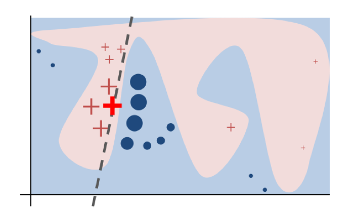
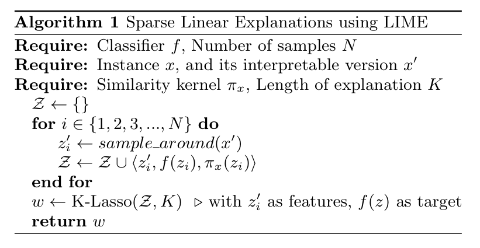
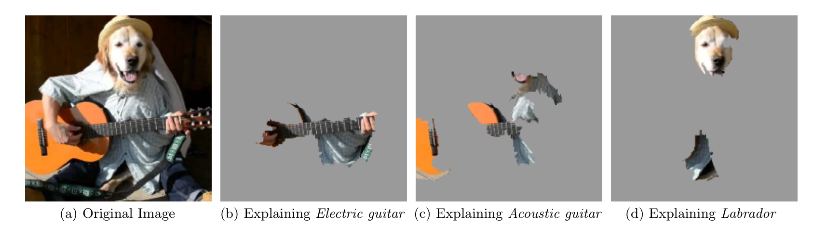
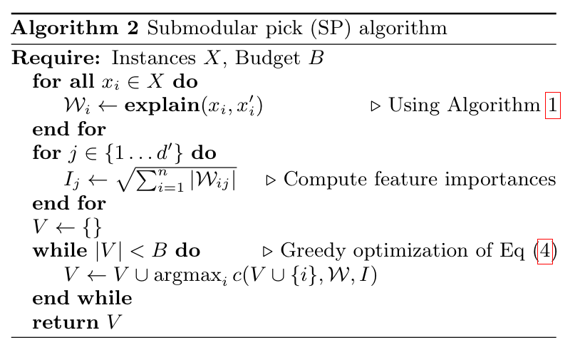

---
title:
  ko: '[xAI] LIME'
  en: '[xAI] LIME'
tags:
- PaperReview
style: border
img: '../assets/images/LIME/image-1.png'
description:
  ko: "'Why Should I Trust You?: Explaining the Predictions of Any Classifier' 논문 리뷰를 바탕으로 기초 xAI 방법론 LIME을 다룬다."
  en: "Handle basic xAI method LIME by reviewing 'Why Should I Trust You?: Explaining the Predictions of Any Classifier' Paper"
---

<!-- 한국어 콘텐츠 -->


> 논문 바로가기 : [Why Should I Trust You?: Explaining the Predictions of Any Classifier (2016)](https://arxiv.org/abs/1602.04938)




1. xAI의 필요성
2. LIME의 3원칙 
3. 수식
4. 작동순서
5. SP-LIME으로 확장 
6. LIME의 단점




## 1. xAI의 필요성 
고전 통계 모형들과 달리, 거대한 파라미터로 구성된 현대 AI는 해석 불가능한 블랙 박스 모델이다. 어떤 파라미터가 데이터의 어떤 특징을 잡아내 이런 결과를 도출하는지 알 수 없다. 해석 불가능성 문제는 결정에 대한 설명을 이끌어 낼 수 없기에 의료 분야와 같이 규제가 엄격한 산업에서 제약이 발생한다. 또한 어떤 것에 반응했는 지 알 수 없기 때문에 모델의 성공 및 실패 요인을 알 수 없다. 예를 들어, 환자 식별 번호와 증상 사이의 상관이 높게 나오는 엉뚱한 결과를 잡아낼 수가 없어 효율적인 특징 공학을 불가능하게 만든다.  

LIME은 블랙박스 모델을 근사하는 **해석가능한 모델을 국소 영역에 적용해, 모델이 이 데이터에서, 어떤 것에 반응해 이런 예측을 했는지를 잡아내** 블랙박스 모델을 부분적으로 해석 가능하게 만든다. 

## 2. LIME의 3원칙 

LIME은 **지역적 충실도, 해석 가능성, 모델 불가지론** 3원칙을 바탕으로 설계되었다. 

1. **지역적 충실도 (Local Fidelity)**  
LIME은 전역 행동을 모사하는 것을 과감하게 포기한다. 실현가능성이 낮기 때문이다. 대신, 설명의 대상이 되는 데이터와 그 주변 영역에서 원본 모델을 최대한 똑같이 근사하는 것을 목표로 한다.  

2. **해석 가능성 (Interpretability)**  
설명 가능 모델은 인간이 이해할 수 있을 정도로 직관적이어야 한다. 따라서 LIME은 데이터와 모델 모두 해석 가능한 것을 이용한다. 모델에는 sparse linear model, 결정 트리와 같은 고전적 통계 모형을 사용한다. 데이터의 경우, 실제로 원본 모델에 들어가는 데이터가 고차원 데이터라도 이진법으로 표현된 아주 단순하고, 해석가능한 표현으로 바꾼다. 예를 들어, 원래 자연어 처리 분야에서는 각 자연어를 워드 임베딩을 통해 차원을 늘리고 표현력을 높인다. 하지만 LIME에서 사용하는 입력 데이터는 전체 어휘부(N) 만큼의 크기를 갖고, 각 값을 binary(01)하게 표현한다. 

3. **모델 불가지론 (Model-Agnosticism)**  
LIME은 원 모델을 단순히 블랙박스로 취급할 뿐, 다른 규제를 두지 않는다. 이 간단한 가정은 어떤 모델에도 적용할 수 있다는 범용성을 가져 LIME을 매우 유용하고 강력하게 만든다. 

   

위 이미지는 LIME의 목표를 시각화한 것이다. 실제 모델$f$는 선형으로 근사되지 않는 구불구불한 경계를 갖고 있다. (배경으로 깔린 부분) LIME은 전역 모델링을 목표로 하지 않고 국소 영역 해석에 집중한다. 목표 데이터 $x$와 주변부 데이터를 완벽하게 구분하는 boundary 선형식을 근사한다. 

## 3. 수식 

LIME은 아래 식을 최적화한다. 이는 다양한 해석 가능한 모델 집합 ($G$)에서 가장 낮은 $\mathcal{L}$을 갖는 $g$를 찾는다. 
$$\text{explanation}(x) = \arg\min_{g \in G} \mathcal{L}(f, g, \pi_x) + \Omega(g)$$

$$L(f,g,π_x) = \sum\limits_{z,z^′\in\mathbb{Z}} π_x(z) (f(z)−g(z^′))^2$$

- $f$: 설명하고자 하는 원본 복잡 모델 (블랙박스)  
- $g$: 설명을 생성하는 단순하고 해석 가능한 모델  
- $\pi_x = exp(-D(x,z)^2/\sigma^2)$: 설명 대상 인스턴스 $x$ 주변의 지역성(locality)을 정의하는 근접성 측정 함수(커널). $x$에 가까운 샘플에 더 높은 가중치를 부여한다. $D$는 데이터 사이의 거리, $\sigma$는 편차 및 너비를 나타낸다.  
- $\mathcal{L}(f, g, \pi_x)$: 충실도 함수(fidelity function). $\pi_x$에 의해 정의된 지역 내에서 $g$가 $f$를 얼마나 부정확하게 근사하는지를 측정하는 손실 함수로, 주로 가중 제곱 손실(weighted squared loss)이 사용된다.   
- $z$ : 원본 모델 $f$에 들어가는 데이터
- $z^′$ : 모델의 해석 가능성을 높이기 위해, $z$를 binary하게 표현한 $g$에 들어가는 입력 데이터 
- $\Omega(g)$: 설명 모델 $g$의 복잡도에 대한 페널티 항. 선형 모델의 경우, 이는 희소성(sparsity)을 유도하여(ex. LASSO 회귀) 설명의 가독성을 높인다. 

## 4. 작동순서 

1. 🌟 **인스턴스 섭동(Perturb)** : $x$의 주변에서 $N$개의 섭동된(perturbed) 샘플을 생성해 새로운 데이터셋을 만든다. 섭동이란, 원본 모델의 작동 방식을 파악하기 위해 원본 데이터를 의도적으로 조금씩 변형한 데이터를 의미한다. 데이터를 섭동하는 방식은 입력 데이터의 특성에 따라 상이하다. 예를 들어, 표 형식의 Tabular 데이터의 경우 설명하려는 원본 샘플의 특징을 정규분포로 모델링 해, 새로운 가상 데이터를 생성한다. 텍스트 데이터의 경우 단어를 제거해 다양한 유사한 문장을 만들어낸다. 이미지의 경우, 텍스트와 비슷하게 특정 영역을 제거한다. 이때 특정 영역은 슈퍼 픽셀이라는 의미 있는 덩어리다. (따로 구하는 방법론이 있음) 
2. **타겟값 수집** : 원본 모델 $f$를 이용해 섭동된 샘플 데이터 $N$개의 예측값을 수집힌다.  
3. **샘플 가중치 부여** : 수집한 섭동된 데이터(1)와 예측값(2)을 바탕으로 원본 $x$와의 근접도에 따라 가중치를 부여한다.  
4. **해석 가능한 모델 학습** : 수집한 섭동된 데이터(1)와 예측값(2)을 바탕으로 해석 가능한 모델$g$을 학습한다.  
5. **모델 해석 단계** : (4)에서 얻은 결과를 바탕으로 $g$의 파라미터를 통해 $x$의 예측을 설명한다. 

(+) 슈퍼 픽셀로 구획된 이미지  
  

## 5. SP-LIME으로 확장 
SP-LIME(Submodular pick LIME)은 LIME을 지역적 개별 예측에서 전역적인 해석까지 확장하기 위해 고안되었다. 지역적 설명은 개별 예측에는 효과적일 수 있지만, 전반적인 모델의 설명으로는 불충분하기 때문이다. SP-LIME은 모델의 행동을 설명할 수 있는 대표성 집합 인스턴스를 골라 제시하는 방법론이다.  

이 방법론은 submodular optimization problem로, 설명이 다양한 중요 특징을 최대한 포괄하는 $B$개의 인스턴스를 찾고자 한다.  

알고리즘은 다음과 같다.  
  

1. 먼저 모든 데이터에 대해 single LIME을 적용해 각 항목별 가중치($W$)를 얻는다.  
2. $\sqrt{\sum_{i=1}^{n} |\mathcal{W}_{ij}|}$ 로 각 데이터 별 전역적 중요도를 계산한다. 많은 설명에서 중요하게 나타나는 핵심요소일 수록 $I_j$ 값이 높다.    
3. greedy-algorithm을 이용해 최적의 집합을 찾는다. 

(+) 커버리지 점수 ($c$ 공식)  

$$c(V,W,I)= 
∑^{d^′}\limits_{j=1}1I_j$$

greedy-algorithm에서 이용하는 함수로 현재 내가 선택한 집합 $V$가 특징을 제대로 담고 있는지를 파악한다.  
​
## 6. LIME의 단점 

1. kernel에 의해 이웃이 결정되지만, robust한 커널이 없지만 해당 값에 민감하다.  
2. 무작위 섭동 과정에 의해 결과가 일관되지 않을 수 있다. 이는 설명의 불안정성을 높인다.  
3. 선형 근사 기반 모델이기 때문에 비선형적인 결정 경계를 잘 근사하지 못하고 의사 결정을 뭉갠다.  


<!-- 영어 콘텐츠 -->


Write the English content here.


  {{ ko_content | markdownify }}

  {{ en_content | markdownify }}

