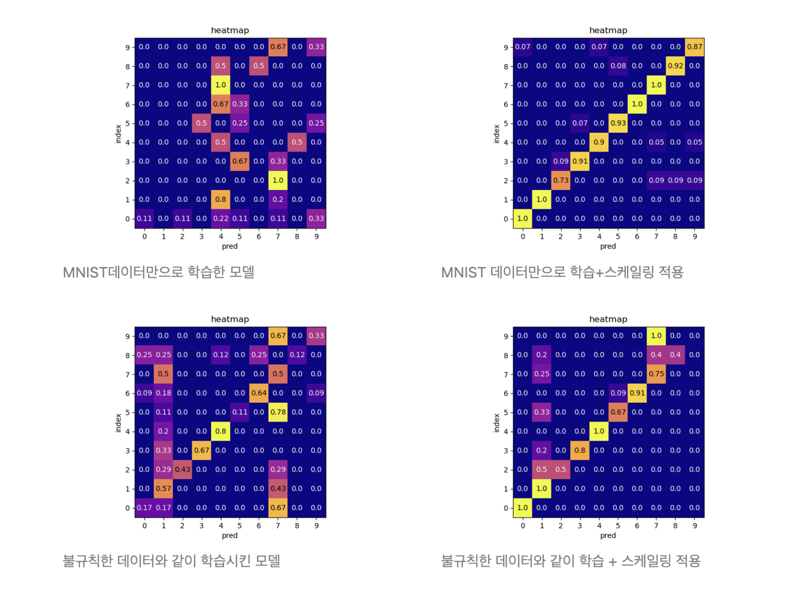


# {{ page.name.ko | default: '프로젝트 이름(한글)' }}

## 1. 🔗 프로젝트 개요 & 링크
MNIST 기반 CNN 모델을 구현하고, PyQt5 데스크톱 앱으로 누구나 손글씨 숫자를 테스트할 수 있도록 UI를 제작했습니다.



## 2. ✨ 핵심 역량 & 문제 해결
- 데이터 증강과 정규화를 조합해 손글씨의 노이즈·기울기·크기 편차를 완화했습니다. 
- 사용자가 직접 그린 숫자를 실시간으로 전처리·추론하는 PyQt5 UI 구현했습니다. 
- 증강 중 발생하는 스택오버플로우 상황을 인지하고 해결해 잘 판별되지 않던 '1' 데이터 판별 성능을 높였습니다. 

## 3. ⚙️ 개발 과정
1. MNIST dataset을 기반으로 CNN 숫자 데이터 판별 모델을 제작
2. MNIST 기반 모델을 바탕으로 손글씨 추론하는 PyQt5 UI 구현 
3. 직접 손글씨 데이터를 수집하고, PyQt5 UI를 통해 데이터를 라벨링
4. 자체 수집 숫자 데이터와 MNIST를 섞어가며 실험을 진행 

## 4. 📊 결과 & 성과
- MNIST 데이터만 사용하고, PyQt5 UI 내부에서 즉각적인 증강을 하는 조합이 최고 성능인 92.6%를 달성했습니다. 
- 직접 수집한 손글씨 데이터의 증강과 MNIST 데이터를 섞었을 때는 성능이 좋지 않았습니다. 

## 5. 💡 배운 점 & 다음 단계
- 처음 프로젝트를 진행해 보았는데, 코드 예제만 따라치다가 스스로 문제를 정의하고 해결하는 과정이 처음에는 막막했습니다. 하지만 문제의 원인을 고민해보고 찾아서 해결하는 과정에서 새로운 즐거움을 느낄 수 있었습니다. 
- 스택오버플로우 문제를 인지에 가장 큰 도움을 준 건 시각화였습니다. 시각화를 통해 증강한 1 데이터가 테두리만 남고 내부 채움이 날라가있음을 확인할 수 있었습니다. 




# {{ page.name.en | default: 'DigitFusion' }}

## 1. 🔗 Overview & Links
Implemented an MNIST-based CNN classifier and wrapped it in a PyQt5 desktop app so anyone can sketch digits and receive instant predictions.



## 2. ✨ Core Strengths & Problem Solving
- Combined augmentation and normalization to handle noise, skew, and size variation in handwriting samples.
- Built a PyQt5 interface that preprocesses user drawings in real time and forwards them to the inference pipeline.
- Identified and fixed an augmentation overflow issue that had weakened recognition accuracy for the digit “1.”

## 3. ⚙️ Development Process
1. Trained a CNN classifier on the MNIST dataset.
2. Implemented a PyQt5 UI that performs immediate handwriting inference.
3. Collected self-written digit samples via the UI and labeled them on the spot.
4. Experimented with blending self-collected data and MNIST to evaluate performance trade-offs.

## 4. 📊 Results & Outcomes
- Achieved 92.6% accuracy when training solely on MNIST with on-the-fly augmentation inside the PyQt5 app.
- Mixing augmented handwritten samples with MNIST reduced accuracy, highlighting the need for better domain alignment.

## 5. 💡 Learnings & Next Steps
- Defining problems and debugging without examples felt daunting at first, but solving them became a rewarding loop.
- Visualization was key: it showed that augmented “1” digits lost their filled strokes, leading directly to the stack overflow fix.



  {{ ko_content | markdownify }}

  {{ en_content | markdownify }}

