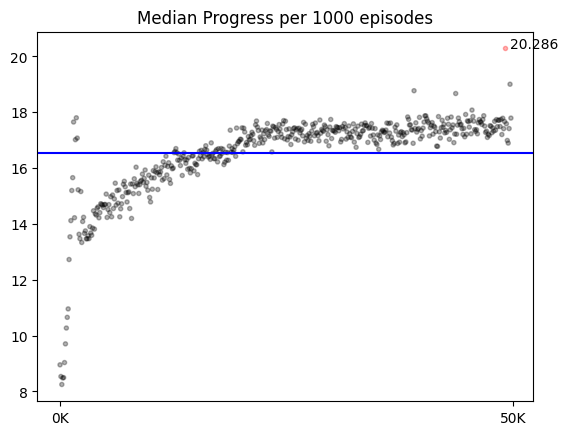
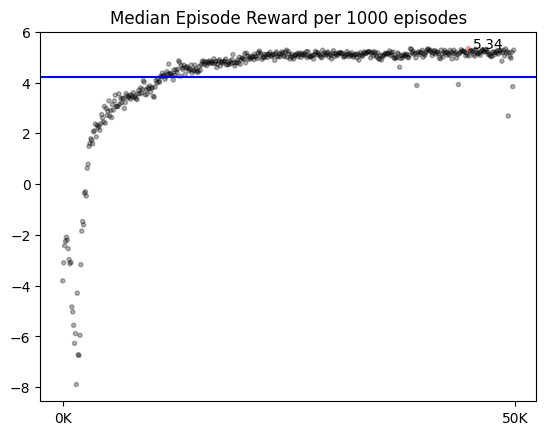
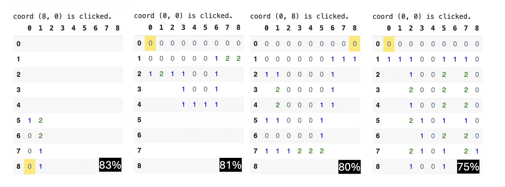
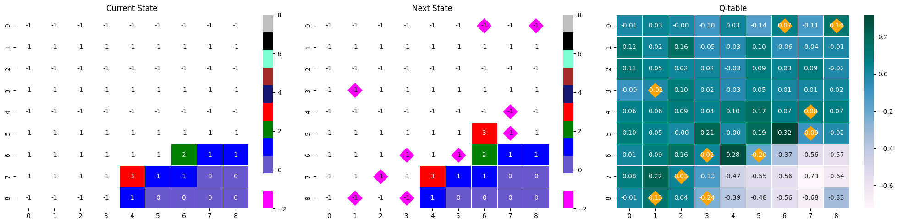

<!-- 한국어 콘텐츠 -->

  

# Minesweeper


How to use
About Minesweeper 
Related Articles
Results



## How to use 
  
학습 SOTA를 기준으로 제작했으며, 지뢰찾기를 도와주는 기능을 갖고 있다.  

  
강화학습용 지뢰찾기 환경이 제작되어져 있는 라이브러리다. 임포트해 사용할 수 있다. 

  
학습에 사용된 모든 코드를 확인할 수 있다. 

## About Minesweeper 
<table>
  <tr>
    <td>
      
    </td>
    <td>
      
    </td>
    <td>
      
    </td>
  </tr>
</table> 
지뢰찾기는 맵에 깔려있는 모든 지뢰를 찾는 게임이다. '찾는다'는 지뢰라고 판단되는 타일을 건들이지 않는 것이다. 따라서 지뢰찾기의 승리조건은 지뢰가 아닌 나머지 모든 타일을 다 까는 것과 같다. 이 맥락에서 일반적으로 지뢰찾기 게임 내 존재하는 깃발 기능은 필수가 아니다. 깃발은 찾아낸 지뢰를 표시하기 위해 있는 기능이다. 승리조건에 미루어 비춰 볼 때, 깃발은 플레이어의 편의성을 위해 존재하는 기능일 뿐 필수요건은 아니다. 따라서 본 프로젝트에서는 깃발 기능을 구현하지 않고 진행했다.  

지뢰찾기의 난이도는 초급 중급 고급으로 나누어져 있다.  

| Level | Height | Width | Num of Mine | density | 
| - | - | - | - | - | 
| 초급 | 9 | 9 | 10 | 12.3% | 
| 중급 | 16 | 16 | 40 | 15.6% | 
| 고급 | 16 | 30 | 99 | 20.6% | 

구현한 환경으로 커스텀 포함 모든 난이도로 학습이 가능하지만, 본 프로젝트는 초급(9*9, 지뢰 10개)을 기준으로 진행했다.  

### RL 
DQN 방법론을 이용했으며, 구체적인 내용 및 구현은 Ch.03에 기재되어 있다. [@ DeepMind Gym](https://gymnasium.farama.org/api/env/) 스타일을 따라 `step()`, `reset()`, `render()`, `action_space`가 구현되어 있다.  

### 학습 환경 
코랩에서 학습을 진행했다. T4 GPU / L4 GPU / A100 GPU를 사용했고, A100을 기준으로 20만 에피소드(valid 포함) 6시간 25분이 소요됐다. 


## Related Articles








## Results
### Test : 모델들 성능비교
> 💡 100 에피소드로 승률을 구하는 사건을 100번 반복

| State | info. | mean (± sd) |  min / max | 
| - | - | - | - | 
| 2D | [RM 수정 버전] 행동 강제 제한 버전, Guess-0.3, conv_units=64  | 0.447 (± 0.044)| 0.33 / 0.56 |
| 2D | [RM 수정 버전] Guess-0.3, No progress -0.5 with bias=F model, conv_units=64  | 0.478 (± 0.049)| 0.39 / 0.65 |
| 2D | [RM 수정 버전]  Guess 0.3, no_progress -0.5 | 0.738 (± 0.038)| 0.69 / 0.83 |
| 2D | [RM 수정 버전] Guess-0.3, No progress -0.5 with done=T  | 0.773 (± 0.046)| 0.66 / 0.89 |
| 2D | [RM 수정 버전] Guess0.1  | 0.795 (± 0.045)| 0.69 / 0.93 |
| 2D | Guess0.3 | 0.798 (± 0.036)| 0.69 / 0.87 | 
| **2D** | **Guess0.1** | **0.826 (± 0.040)**| 0.74 / 0.93 |
| **3D** | **Guess0.3** | **0.834 (± 0.040)**| 0.69 / 0.91 |
| **3D** | 👑 **Guess0.1** | **0.839 (± 0.037)**| 0.73 / 0.92 | 


### 최고 성능 모델의 하이퍼 파라미터  

| Category | Hyper params | info | value | 
| - | - | - | - | 
| Replay Memory | MEM_SIZE(MAX) | 리플레이 메모리의 저장 가능한 최대 한도| 50,000 |
| Replay Memory | MEM_SIZE_MIN | 학습을 시작하기 위한 최소 메모리의 수 | 1,000 |
| Neural Net | BATCH_SIZE | train시 신경망에 들어가는 batch 크기 | 64 |
| Neural Net | CONV_UNITS | 합성곱 신경망의 채널 수 | 128 |
| Neural Net | **LEARNING_RATE** | 최대 학습률이자 시작 학습률| 0.001 |
| Neural Net | LEARN_DECAY | 학습률 가감 비율 | 0.25 |
| Neural Net | LEARN_EPOCH | 학습률 가감 주기 | 50000 |
| Target Model | UPDATE_TARGET_EVERY | 오프폴리쉬 방식인 Q러닝을 위해 model과 target model 사이에 주는 업데이트 시간차  | 5 |
| Exploration | EPSILON | 최대 탐험 비율이자 시작 탐험 비율 | 0.95 | 
| Exploration | EPSILON_DECAY | 탐험 비율 감소 비율 | 0.999975 | 
| Exploration | EPSILON_MIN | 최소 탐험 비율 | 0.01 | 
| Q-learning | DISCOUNT | 할인율 | 0.1 | 

---

- **loss_fn** : `nn.MSELoss()`
- **optimizer** : `optim.Adam()`
- **scheduler** : `optim.lr_scheduler.StepLR()`
- **DQN 구현 방식** : `vector type`
- **학습 및 모델 업데이트 주기** : 매 step마다

### 최고 성능 모델의 보상 구조  

| Reward | Description & Purpose | Weight | Done | 
| - | - | - | - | 
| Win | 지뢰가 아닌 모든 타일을 깐 경우 | 1 | True |
| Lose | 깐 타일이 지뢰인 경우 | -1 |True |
| Progress | 주변부에 까진 타일이 있고, 지뢰가 아닌 타일을 깐 경우 | 0.3 | False |
| Guess | 주변부가 까져 있지 않지만, 지뢰가 아닌 타일을 깐 경우 | 0.1 | False |
| No Progress | 이미 누른 타일을 또 누른 경우 | -1 | False |  

### visualize 

- test : 에피소드 전체 시각화 

  

순서대로 현 state, 행동으로 변한 다음 state, 현 state가 입력되었을 때 Q-table이다.  
next_state와 Q-table에 시각화되어 있는 마름모는 게임 내 지뢰의 위치를 나타낸다. 

- 최고 성능 시각화 그래프 (50만 에피소드)
<table boarder="0">
  <tr>
    <td></td>
    <td></td>
  </tr>
  <tr>
    <td></td>
    <td></td>
  </tr>
</table>

최고 수치 기준, 
- step의 중앙값 : 20.286, 총 보상의 중앙값 : 5.36, 승률 : 0.853

후반부 대략적인 수치,
- step의 중앙값 : 17-18, 총 보상의 중앙값 : 5, 승률 : 0.83-84


### 첫 행동으로 지뢰찾기 판의 꼭짓점을 선택한다. 
내가 학습한 모델 중 성능이 75%가 넘는 모델들은 공통적으로 지뢰찾기 판의 꼭짓점 위치 타일을 첫 번째로 선택했다. 



지뢰찾기는 모든 타일이 가려진 채 시작되기 때문에 추론 가능한 상태까지 가기 위해서 최대한 많은 타일을 초반 스텝에 까는 것이 중요하다. 따라서 무조건 지뢰가 아닌 첫 번째 행동에서 최대한 많은 타일이 까지는 것이 승리에 영향을 미친다. 성능이 50% 가량되는 모델들에서는 이 전략이 발견되지 않았기에, 에이전트가 학습한 이 전략이 승률을 높이는데 도움을 주었다는 가설을 세웠고 이를 확률론적 관점에서, 몬테카를로적 관점에서, Q-러닝적 관점에서 분석했다. 

#### 01. 확률론적 분석 
이 분석에서는 확률론적으로 왜 꼭짓점에 위치한 타일을 선택하는 것이 유리한 행동인지를 보여준다. 여기서 말하는 유리한 행동이란, 첫 선택에서 0을 눌러 초반부터 큰 범위의 영역 정보를 얻는 것이다. 

---

첫 번째 선택에서는 지뢰가 까지지 않는다는 가정,  
- 까지지 않은 총 타일 수 : 81
- 지뢰 개수 : 10개
- 지뢰가 아닌 타일 수 : 71개  

---
1. 꼭짓점에 위치한 타일을 깔 때, 타일이 0일 확률  [이웃 타일 : 3개]
```r
choose(70,3) / choose(80,3) # 0.666261 : 누르는 타일을 제외해 70,80
```
2. 테두리에 위치한 타일을 깔 때, 타일이 0일 확률 [이웃 타일 : 5개]
```r
choose(70,5) / choose(80,5) # 0.5034528 
```
3. 중앙에 위치한 타일을 깔 때, 타일이 0일 확률 [이웃 타일 : 8개]
```r
choose(70,8) / choose(80,8) # 0.3256693
```

처음 행동에서 0을 눌러 큰 영역 정보를 얻을 확률은 **꼭짓점 > 테두리 > 중앙** 순으로 높다는 것을 알 수 있다. 


#### 02. 몬테카를로 시뮬레이션을 이용한 분석 
시뮬레이션의 표본 수는 10만 개로, 첫 번째 선택에서 랜덤으로 아무 타일을 누를 때 열리는 타일 수와 꼭짓점만을 누를 때 열리는 타일의 수를 비교하고 0을 누를 확률을 근사한다. 

- 열리는 타일의 수 


랜덤으로 행동하는 것보다, 꼭짓점을 깔 때 까지는 면적이 크다. 랜덤은 중앙값이 1인 것에 비해, 꼭짓점은 11이었으며, 극단적으로 많은 타일이 까지는 사건도 꼭짓점을 깔 때 더 많이 발생했다. 

- 타일이 0일 확률 

```r
sum(df[1] != 1) / nrow(df) # vertex : 1개 이상 까질 확률 
[1] 0.66643
```

```r
sum(df[2] != 1) / nrow(df) # random : 1개 이상 까질 확률 
[1] 0.40333
```
꼭짓점을 깠을 때 0을 눌러 한 개 이상 까질 확률은 몬테카를로 시뮬레이션을 이용한 것과 확률론적 값이 동일하다. random의 경우 확률론적 값과 대응시킬 수는 없지만, 꼭짓점을 깔 때보다 확률이 적은 것을 보아 꼭짓점을 까는 행동이 무작위 선택보다도 효율적임을 알 수 있다. 

#### 03. Q-러닝 기반 분석 
큐러닝에서 `state-action` 페어는 next_state의 최대 큐값과 보상을 기준 삼아 업데이트한다. 많은 타일이 까진 state는 원활한 추론이 가능하기에 지뢰를 밟을 확률이 낮아진다. 많은 타일을 까는 행동은 게임이 오버될 확률을 낮추며, 궁극적인 목표인 최대 가치에 다가가는 행동이다. 첫 번째 선택으로 모서리를 까는 행동은 랜덤, 가장자리, 중앙 부분을 까는 행동들보다 0일 확률이 높다. 따라서 이 행동은 다른 선택보다 next_state로 타일이 많이 열린 state를 받을 확률이 높아지고, 그 결과 타 행동보다 높은 Q값을 갖게 된다. 

아래 두 `state-next stat-Qtable`은 위 분석의 명확한 근거가 되어주지는 못하지만, 많은 타일이 열린 Q-table이 어떤 역할을 하는지를 짐작할 수 있다. 

같은 모델의 다른 에피소드 결과물이지만, 많은 타일이 까졌을 때의 max Q값과 거의 까지지 않았을 때의 max Q값 사이에는 차이가 있다. 많은 타일이 까진 경우에는 max 값이 0.32로 컸지만, 타일이 별로 까지지 않은 경우 다른 값들과 거의 유사한 0.17를 가졌다. 이는 추론이 불가능한 상황에서 나타나는 소극적인 Q값으로 해석할 수 있다. 

- max Q값 : 0.17


- max Q값 : 0.32






<!-- 영어 콘텐츠 -->


To be continue...



<div id="content-ko" class="lang-content" data-lang="ko">
  {{ ko_content | markdownify }}
</div>

<div id="content-en" class="lang-content" data-lang="en" style="display: none;">
  {{ en_content | markdownify }}
</div>

