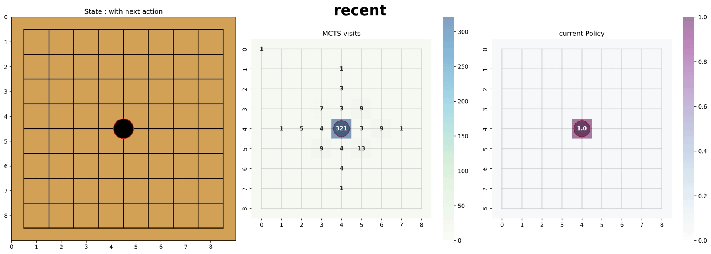

<!-- 한국어 콘텐츠 -->

  

# Omok


How to use
About TicTacToe   
역할
작성한 글



## How to use 
  
학습에 사용된 모든 코드를 확인할 수 있다.  

## Result 
  

## 역할  
24-2 강화시스터즈 동아리 활동의 일환으로 진행한 프로젝트로, 로보틱스 파트, 알파제로 구현, 웹 구현은 담당했다.  
  

## 작성한 글 
  



<!-- 영어 콘텐츠 -->


To be continue...



  {{ ko_content | markdownify }}

  {{ en_content | markdownify }}

