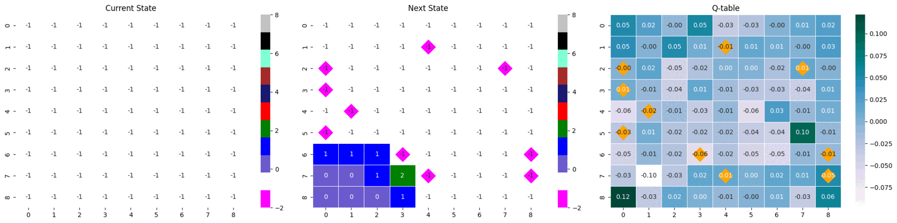


# {{ page.name.ko | default: '프로젝트 이름(한글)' }}

## 1. 🔗 프로젝트 개요 & 링크
 
**고성능 지뢰찾기** 에이전트를 개발하고, 누구나 활용할 수 있도록 **웹 인터페이스**를 구현했습니다.





## 2. ✨ 핵심 역량 & 문제 해결
- 지뢰찾기의 MDP 구조를 이해하고 게임 로직부터 강화학습 환경까지 직접 구현했습니다. 
- DQN을 완전히 이해하기 위해 라이브러리를 사용하지 않고 from scratch로 구현했습니다. 
- 다양한 모델 구조, state 정의, 보상 함수를 최적화하여 40% 수준이던 성능을 평균 84%까지 끌어올렸습니다. 
- 속도 개선을 위해 BFS 알고리즘을 적용하고, for문 최소화로 효율성을 높였습니다. 
- 성능 검증에는 몬테카를로 방식을 적용해 신뢰구간을 제시하며 결과의 신빙성을 강화했습니다. 
- 동아리원 중 가장 빠르게 고성능 모델을 개발했고, 이를 공유하며 다른 구성원을 지도했습니다. 
- [9명의 동아리원 중 최고 성능 모델](https://kanghwasisters.github.io/blog/Presentation24_1)을 달성했습니다. 

## 3. ⚙️ 개발 과정
- 문제 해결 과정, 최종 성능 및 사후 분석을 정리했습니다. 



## 4. 📊 결과 & 성과
- (학습 기준) step 중앙값 : 20.286, 총 보상 중앙값 : 5.36, 승률 : 0.853
- (테스트 기준) 승률 평균 및 표준편차 :  	

  

<table>
  <tr>
    <td>
      
    </td>
    <td>
      
    </td>
    <td>
      
    </td>
  </tr>
</table> 

## 5. 💡 배운 점 & 다음 단계
- 기반부터 직접 구현하는 과정을 통해 많은 오류와 시행착오를 겪었고, 이를 극복하며 코딩 실력이 크게 향상되었습니다.  
- 처음 진행한 강화학습 프로젝트로, 지뢰찾기라는 명확한 의사결정 구조를 구현하면서 사람과 AI 플레이어의 시야 차이를 state와 보상에 반영하는 경험을 했습니다. 
- stride, padding, 정규화 등 세부 요소가 성능에 큰 영향을 미친다는 점을 체감했고, Conv-only 구조에서 성능 향상을 확인하며 ML 개발자로서 섬세한 구현의 중요성을 배웠습니다.  




# {{ page.name.en | default: 'MineSolver' }}

## 1. 🔗 Overview & Links
 
**High-performance Minesweeper agent** developed with a web interface for easy access and testing.





## 2. ✨ Core Strengths & Problem Solving
- Designed the Minesweeper environment and game logic as an MDP from scratch.  
- Implemented DQN without external libraries to fully understand the algorithm.  
- Improved performance from ~40% to an average of 84% by optimizing model architecture, state representation, and reward design.  
- Applied BFS for faster inference and minimized for-loops for efficiency.  
- Used Monte Carlo evaluation to provide confidence intervals and ensure reliable performance metrics.  
- Achieved the highest-performing model among 9 club members and guided peers by sharing methods and results.  

## 3. ⚙️ Development Process
- Documented the problem-solving process, performance analysis, and post-project review.  



## 4. 📊 Results & Outcomes
- (Training) Median steps: 20.286, median reward: 5.36, win rate: 0.853  
- (Testing) Average win rate with standard deviation:   

  

<table>
  <tr>
    <td>
      
    </td>
    <td>
      
    </td>
    <td>
      
    </td>
  </tr>
</table> 

## 5. 💡 Learnings & Next Steps
- Building the agent from scratch required overcoming numerous errors, which significantly improved my coding skills.  
- As my first reinforcement learning project, it reshaped how I think about problem-solving. Modeling Minesweeper required careful consideration of the visibility gap between human and AI players, reflected in state and reward design.  
- Experienced firsthand how details like normalization, stride, and padding can make or break performance, and observed a major boost when shifting from Conv+FC to Conv-only structures — reinforcing the importance of fine-grained implementation as an ML developer.  



  {{ ko_content | markdownify }}

  {{ en_content | markdownify }}

